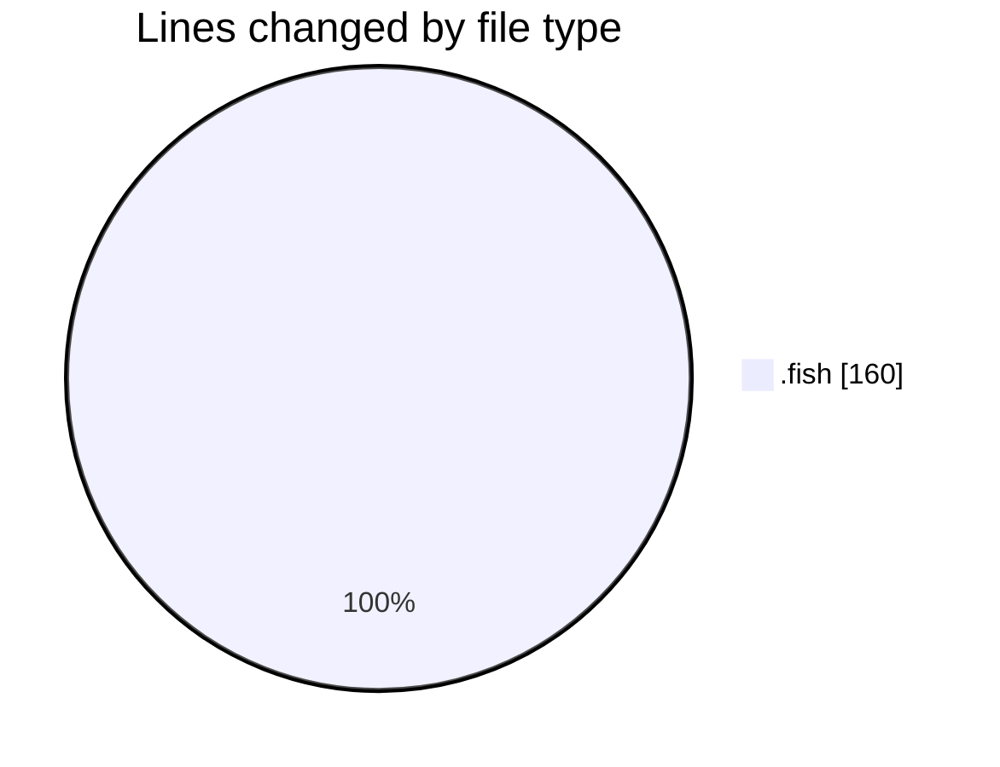
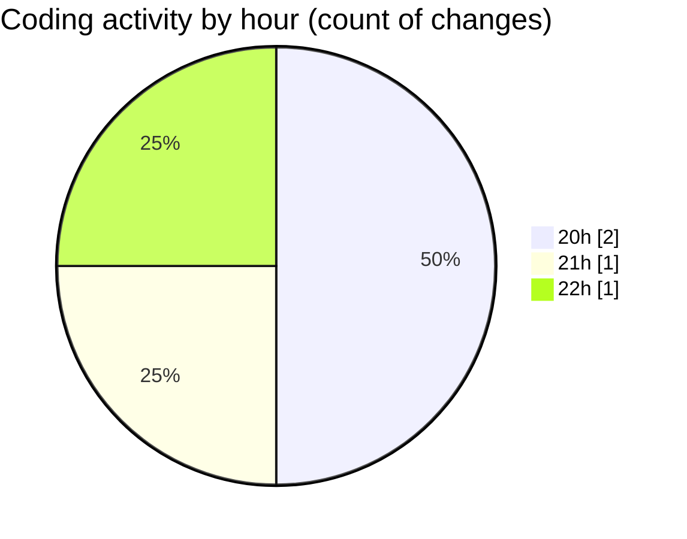

# .config - Activity Summary 

## Overall Statistics

| Stat                   | Value                                                             |
| ---------------------- | ----------------------------------------------------------------- |
| **Lines Added** (➕)   | 130                                          |
| **Lines Removed** (➖) | 30                                        |
| **Net Change** (↕)    | 100                |
| **Active Time** (⌚)   | 3 minutes |

## Modified Files
- **ai_agent_config.fish** (+130, -30)

## Visualizations

### By File Type (Lines Changed)

### By Hour (Estimated Activity Count)

> **Last Updated:** 10/07/2025, 22:15:50