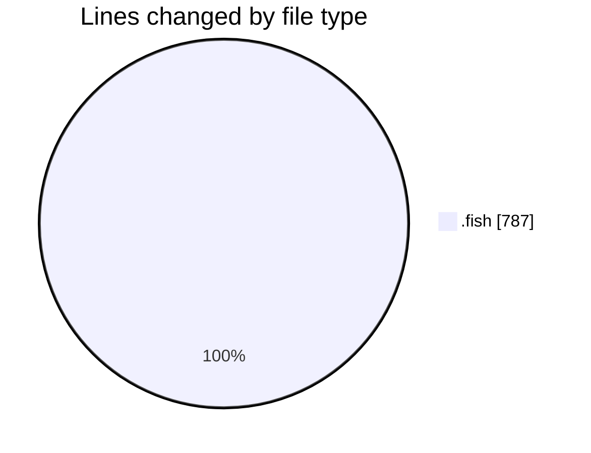
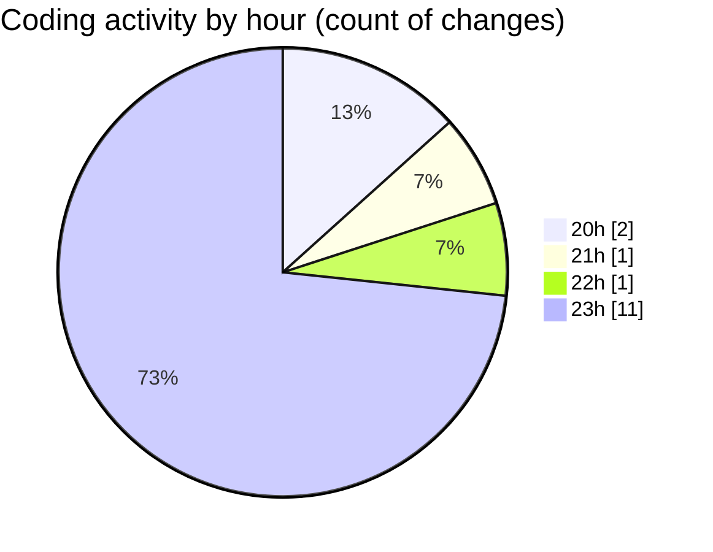

# .config - Activity Summary 

## Overall Statistics

| Stat                   | Value                                                             |
| ---------------------- | ----------------------------------------------------------------- |
| **Lines Added** (➕)   | 611                                          |
| **Lines Removed** (➖) | 176                                        |
| **Net Change** (↕)    | 435                |
| **Active Time** (⌚)   | 17 minutes |

## Modified Files
- **ai_agent_config.fish** (+285, -140)
- **agent.fish** (+181, -36)
- **ai_agent_config.fish** (+145, -0)

## Visualizations

### By File Type (Lines Changed)

### By Hour (Estimated Activity Count)

> **Last Updated:** 10/07/2025, 23:55:50