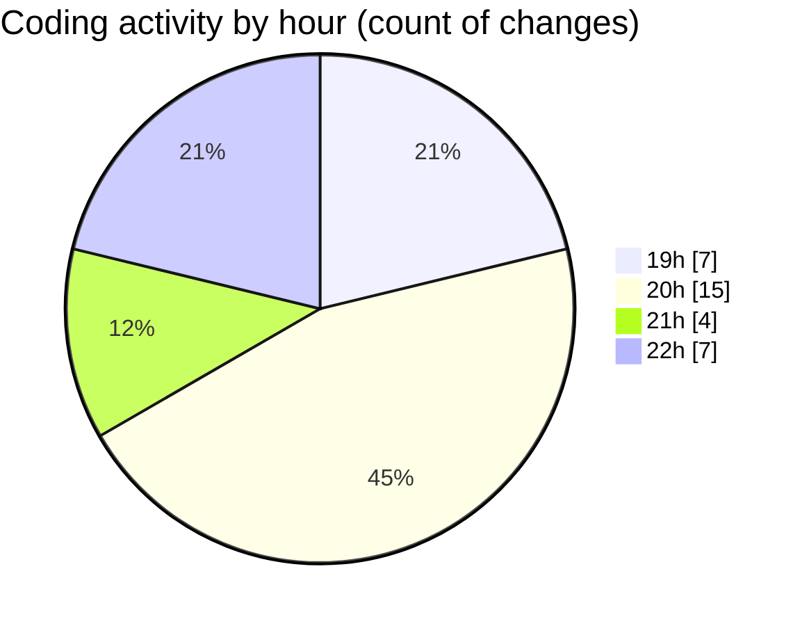

# fish - Activity Summary 

## Overall Statistics

| Stat                   | Value                                                             |
| ---------------------- | ----------------------------------------------------------------- |
| **Lines Added** (➕)   | 3216                                          |
| **Lines Removed** (➖) | 413                                        |
| **Net Change** (↕)    | 2803                |
| **Active Time** (⌚)   | 31 minutes |

## Modified Files
- **config.fish** (+169, -1)
- **plan.md** (+524, -0)
- **keybindings.json** (+586, -8)
- **install.sh** (+721, -287)
- **embeddable_files.txt** (+45, -44)
- **settings.json** (+518, -0)
- **macrowhisper.json** (+183, -0)
- **ai_github_functions.fish** (+398, -3)
- **test_plan.fish** (+72, -70)

## Visualizations

### By File Type (Lines Changed)

### By Hour (Estimated Activity Count)

> **Last Updated:** 10/07/2025, 22:53:19