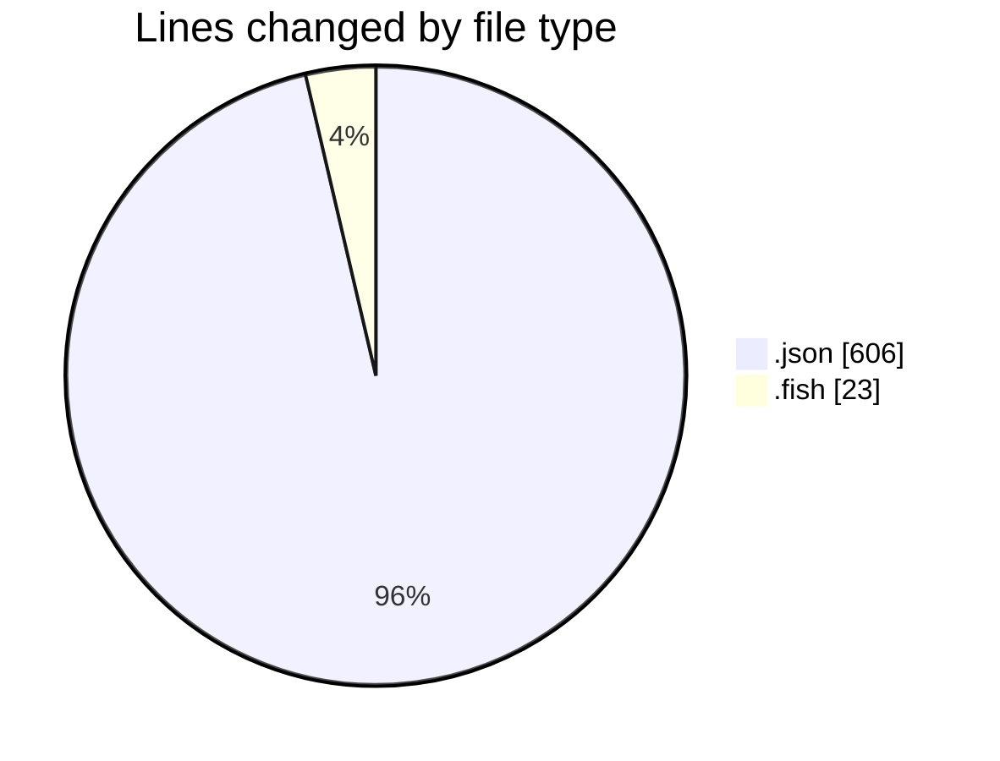
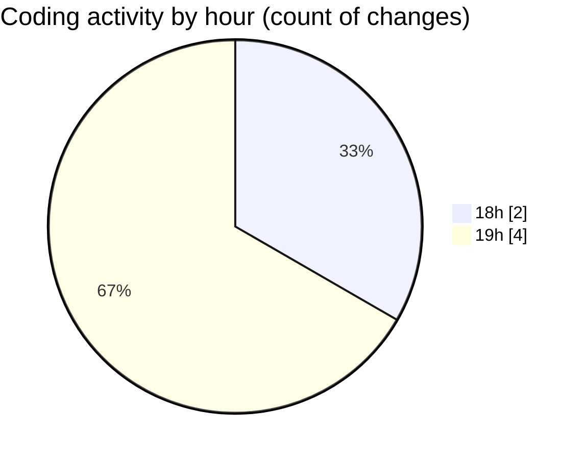

# ribbon - Activity Summary 

## Overall Statistics

| Stat                   | Value                                                             |
| ---------------------- | ----------------------------------------------------------------- |
| **Lines Added** (➕)   | 627                                          |
| **Lines Removed** (➖) | 2                                        |
| **Net Change** (↕)    | 625                |
| **Active Time** (⌚)   | 8 minutes |

## Modified Files
- **mcp.json** (+42, -2)
- **keybindings.json** (+562, -0)
- **config.fish** (+23, -0)

## Visualizations

### By File Type (Lines Changed)

### By Hour (Estimated Activity Count)

> **Last Updated:** 10/07/2025, 19:15:00