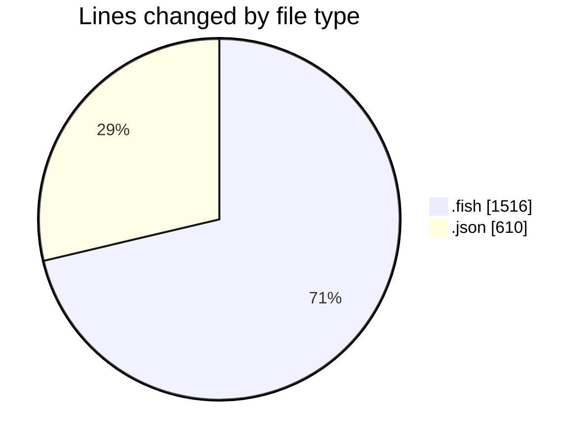
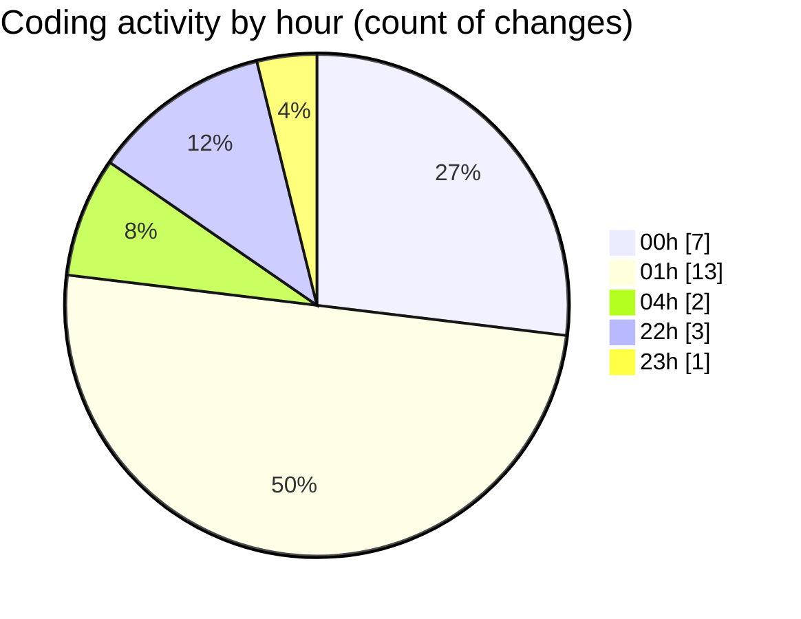

# fish - Activity Summary 

## Overall Statistics

| Stat                   | Value                                                             |
| ---------------------- | ----------------------------------------------------------------- |
| **Lines Added** (➕)   | 1505                                          |
| **Lines Removed** (➖) | 621                                        |
| **Net Change** (↕)    | 884                |
| **Active Time** (⌚)   | 36 minutes |

## Modified Files
- **agent.fish** (+23, -1)
- **keybindings.json** (+594, -16)
- **ai_github_functions.fish** (+576, -337)
- **config.fish** (+51, -143)
- **ai_agent_config.fish** (+145, -124)
- **_start_ribbon_dev_server.fish** (+116, -0)

## Visualizations

### By File Type (Lines Changed)

### By Hour (Estimated Activity Count)

> **Last Updated:** 11/07/2025, 22:09:06