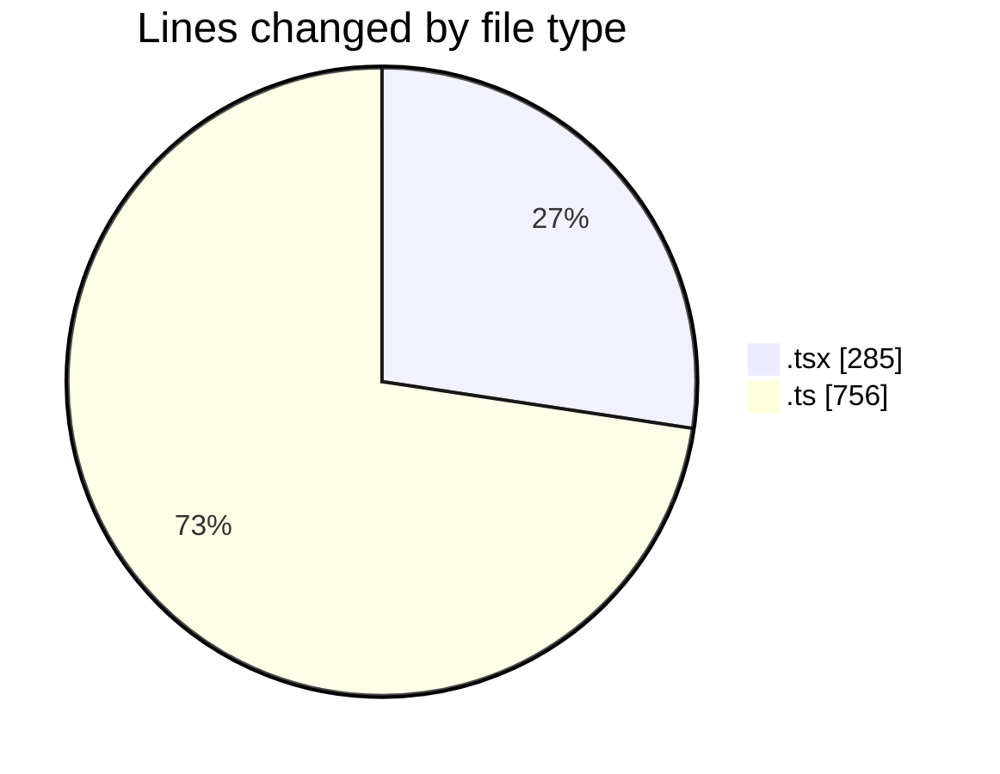

# ribbon - Activity Summary 

## Overall Statistics

| Stat                   | Value                                                             |
| ---------------------- | ----------------------------------------------------------------- |
| **Lines Added** (➕)   | 1003                                          |
| **Lines Removed** (➖) | 38                                        |
| **Net Change** (↕)    | 965                |
| **Active Time** (⌚)   | 11 minutes |

## Modified Files
- **page.tsx** (+15, -0)
- **searchable-materials.tsx** (+141, -35)
- **MiniFinderSingleSelectWithSearch.tsx** (+93, -0)
- **searchable-materials.tsx** (+1, -0)
- **materials.ts** (+681, -3)
- **materialSearch.ts** (+72, -0)

## Visualizations

### By File Type (Lines Changed)

### By Hour (Estimated Activity Count)

> **Last Updated:** 11/07/2025, 02:29:38