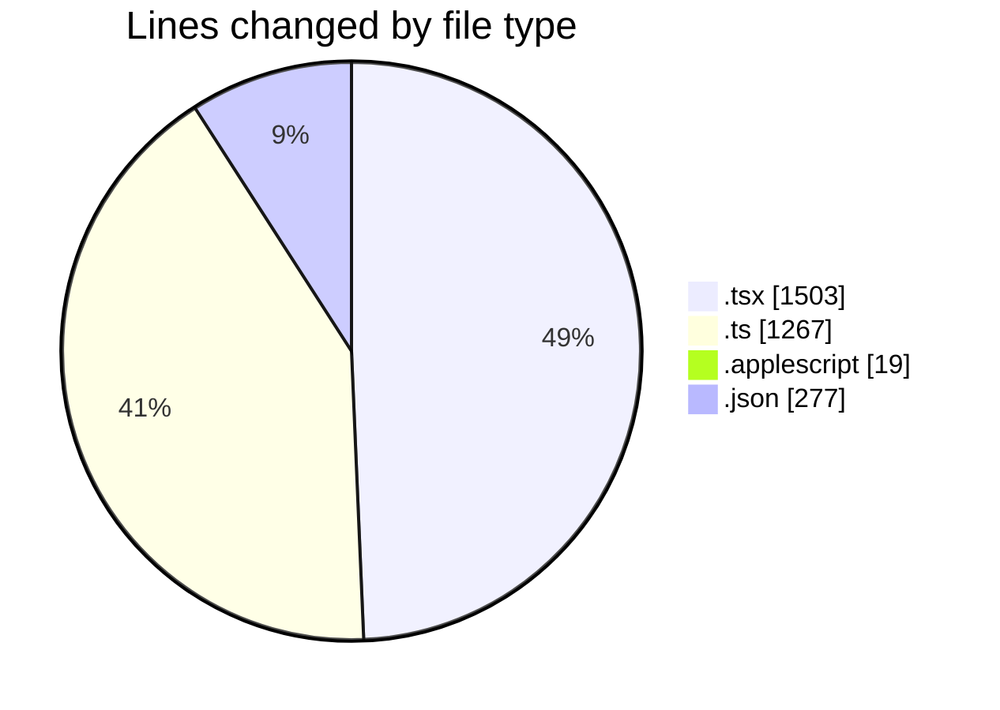
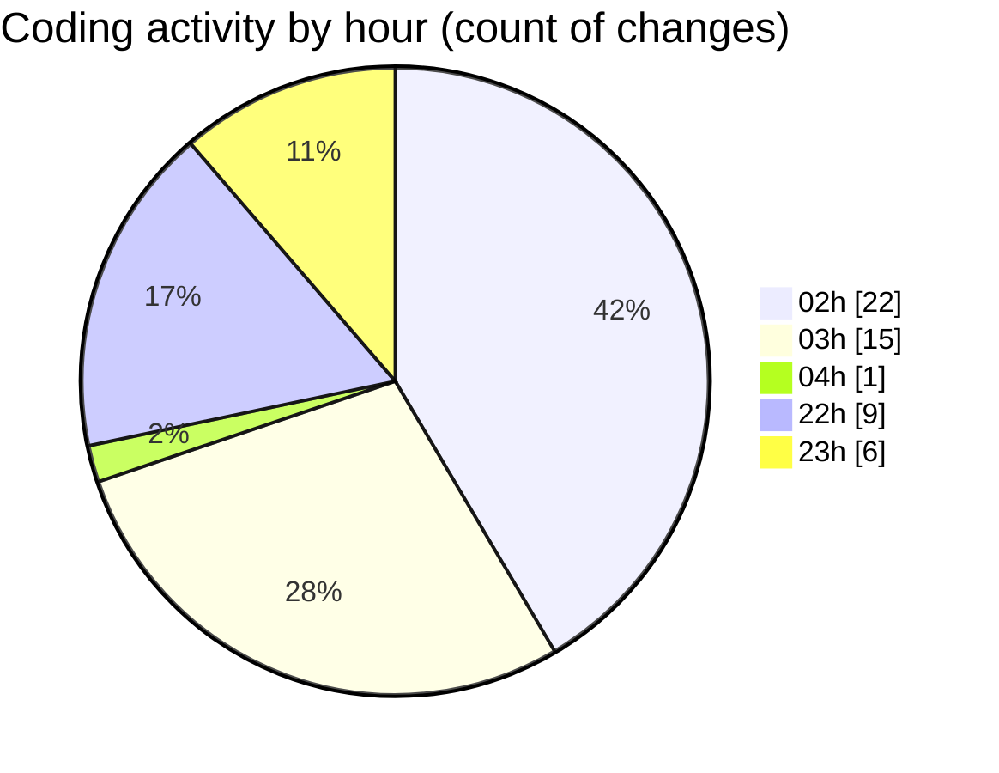

# ribbon - Activity Summary 

## Overall Statistics

| Stat                   | Value                                                             |
| ---------------------- | ----------------------------------------------------------------- |
| **Lines Added** (➕)   | 2704                                          |
| **Lines Removed** (➖) | 362                                        |
| **Net Change** (↕)    | 2342                |
| **Active Time** (⌚)   | 56 minutes |

## Modified Files
- **page.tsx** (+30, -3)
- **searchable-materials.tsx** (+281, -176)
- **MiniFinderSingleSelectWithSearch.tsx** (+93, -0)
- **searchable-materials.tsx** (+1, -0)
- **materials.ts** (+684, -6)
- **materialSearch.ts** (+216, -95)
- **MaterialsFinder.tsx** (+406, -60)
- **Sheet.tsx** (+100, -2)
- **EditMaterials.tsx** (+25, -2)
- **MaterialSelector.tsx** (+98, -0)
- **useSearchMaterials.tsx** (+46, -16)
- **preload.applescript** (+19, -0)
- **package.json** (+3, -2)
- **test-materials-search.ts** (+266, -0)
- **package.json** (+272, -0)
- **searchable-container.tsx** (+164, -0)

## Visualizations

### By File Type (Lines Changed)

### By Hour (Estimated Activity Count)

> **Last Updated:** 11/07/2025, 23:23:44