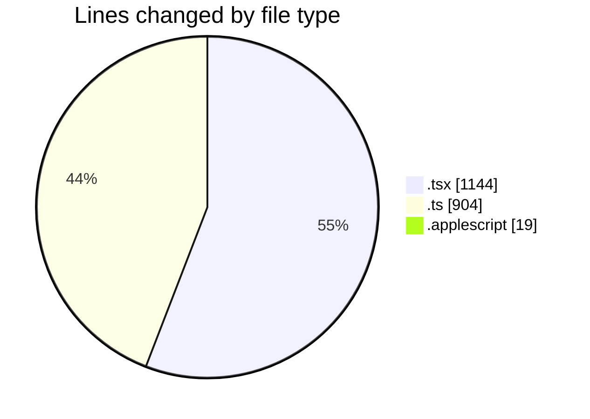
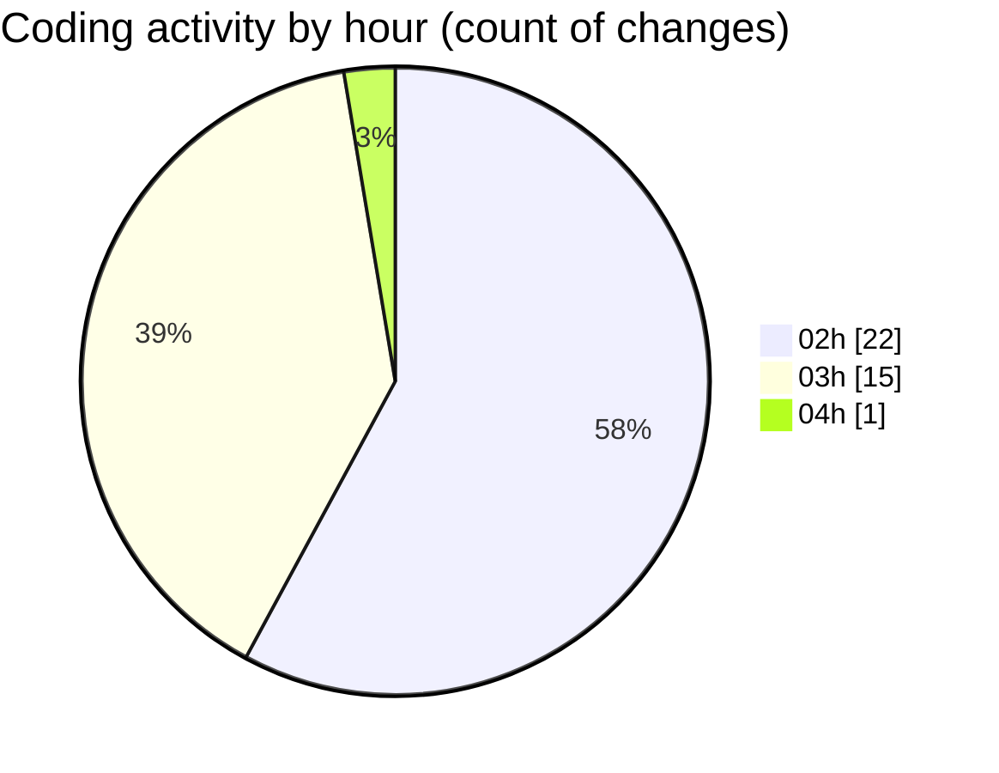

# ribbon - Activity Summary 

## Overall Statistics

| Stat                   | Value                                                             |
| ---------------------- | ----------------------------------------------------------------- |
| **Lines Added** (➕)   | 1734                                          |
| **Lines Removed** (➖) | 333                                        |
| **Net Change** (↕)    | 1401                |
| **Active Time** (⌚)   | 37 minutes |

## Modified Files
- **page.tsx** (+15, -0)
- **searchable-materials.tsx** (+281, -176)
- **MiniFinderSingleSelectWithSearch.tsx** (+93, -0)
- **searchable-materials.tsx** (+1, -0)
- **materials.ts** (+684, -6)
- **materialSearch.ts** (+143, -71)
- **MaterialsFinder.tsx** (+229, -60)
- **Sheet.tsx** (+100, -2)
- **EditMaterials.tsx** (+25, -2)
- **MaterialSelector.tsx** (+98, -0)
- **useSearchMaterials.tsx** (+46, -16)
- **preload.applescript** (+19, -0)

## Visualizations

### By File Type (Lines Changed)

### By Hour (Estimated Activity Count)

> **Last Updated:** 11/07/2025, 04:04:38