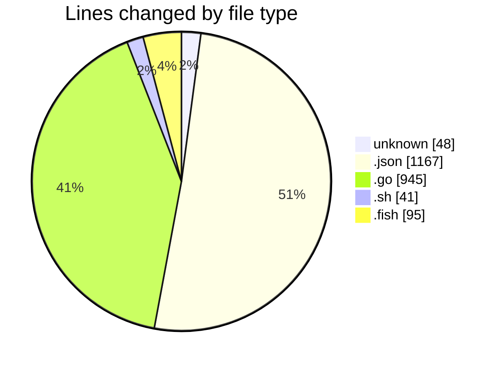
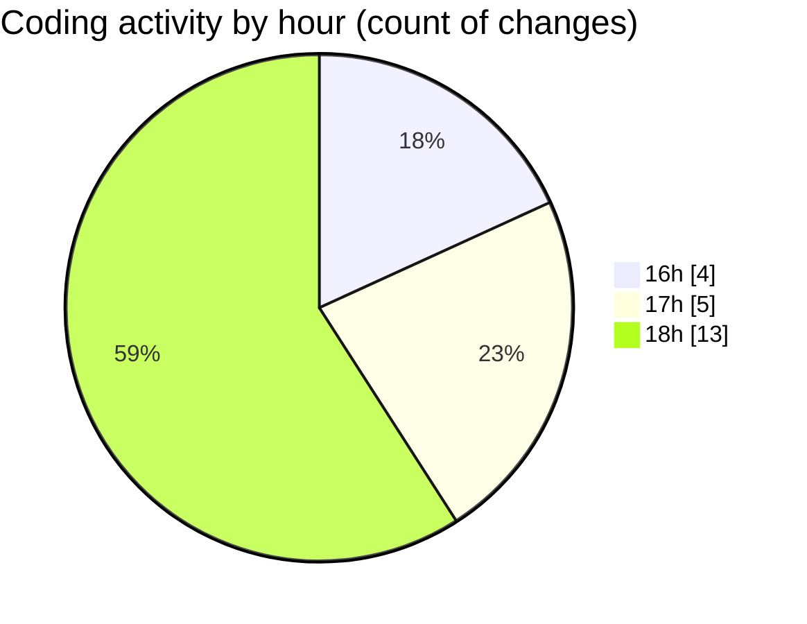

# cursor-openrouter-proxy - Activity Summary 

## Overall Statistics

| Stat                   | Value                                                             |
| ---------------------- | ----------------------------------------------------------------- |
| **Lines Added** (➕)   | 2275                                          |
| **Lines Removed** (➖) | 21                                        |
| **Net Change** (↕)    | 2254                |
| **Active Time** (⌚)   | 25 minutes |

## Modified Files
- **.env** (+27, -21)
- **keybindings.json** (+578, -0)
- **proxy.go** (+945, -0)
- **settings.json** (+589, -0)
- **test_proxy.sh** (+41, -0)
- **test_proxy.fish** (+42, -0)
- **start_proxy.fish** (+22, -0)
- **stop_proxy.fish** (+7, -0)
- **proxy_toggle.fish** (+24, -0)

## Visualizations

### By File Type (Lines Changed)

### By Hour (Estimated Activity Count)

> **Last Updated:** 12/07/2025, 18:59:15