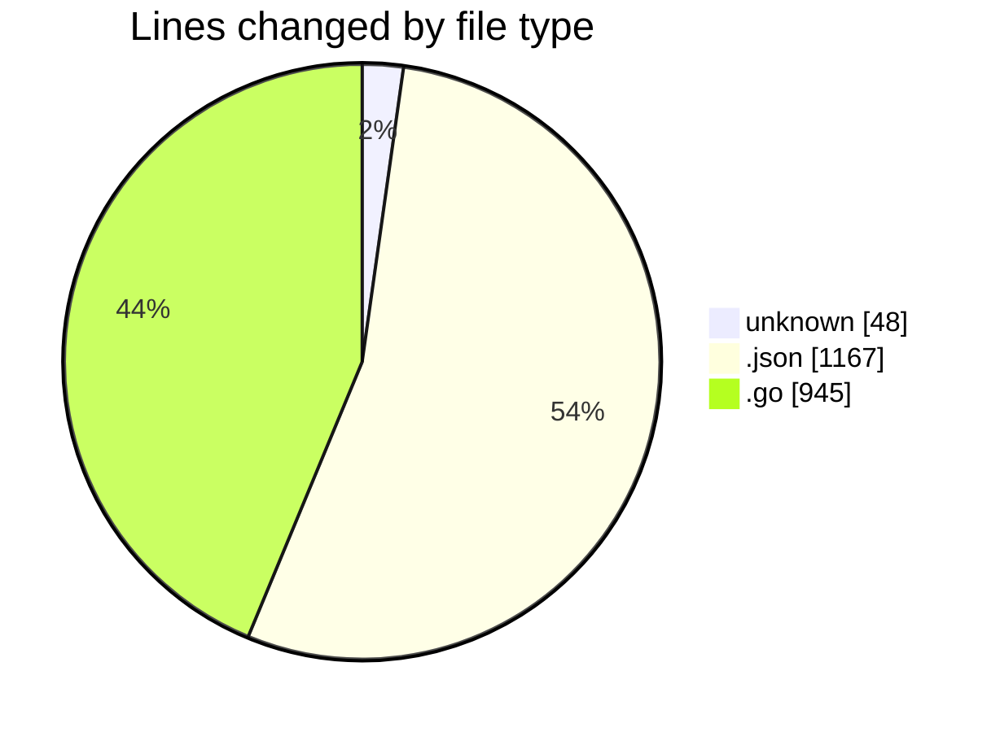
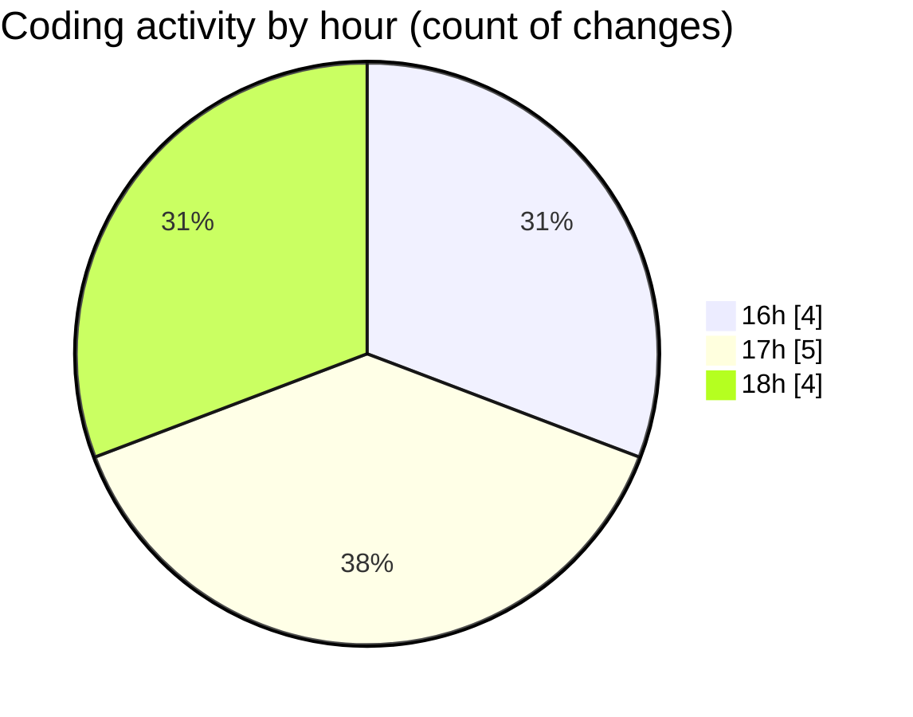

# cursor-openrouter-proxy - Activity Summary 

## Overall Statistics

| Stat                   | Value                                                             |
| ---------------------- | ----------------------------------------------------------------- |
| **Lines Added** (➕)   | 2139                                          |
| **Lines Removed** (➖) | 21                                        |
| **Net Change** (↕)    | 2118                |
| **Active Time** (⌚)   | 12 minutes |

## Modified Files
- **.env** (+27, -21)
- **keybindings.json** (+578, -0)
- **proxy.go** (+945, -0)
- **settings.json** (+589, -0)

## Visualizations

### By File Type (Lines Changed)

### By Hour (Estimated Activity Count)

> **Last Updated:** 12/07/2025, 18:44:15