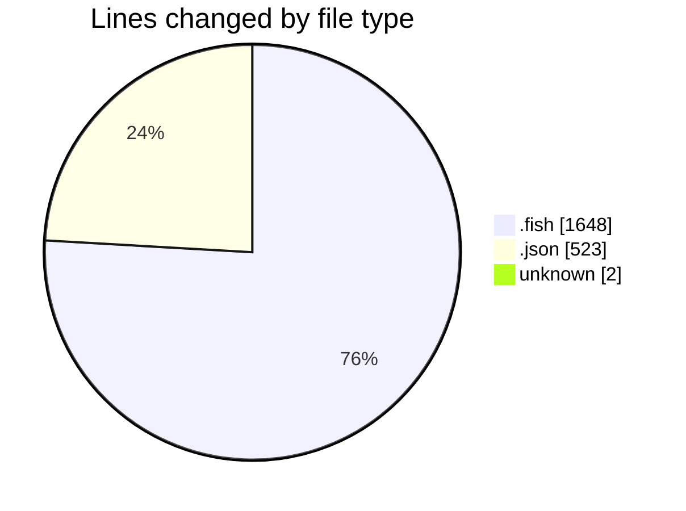
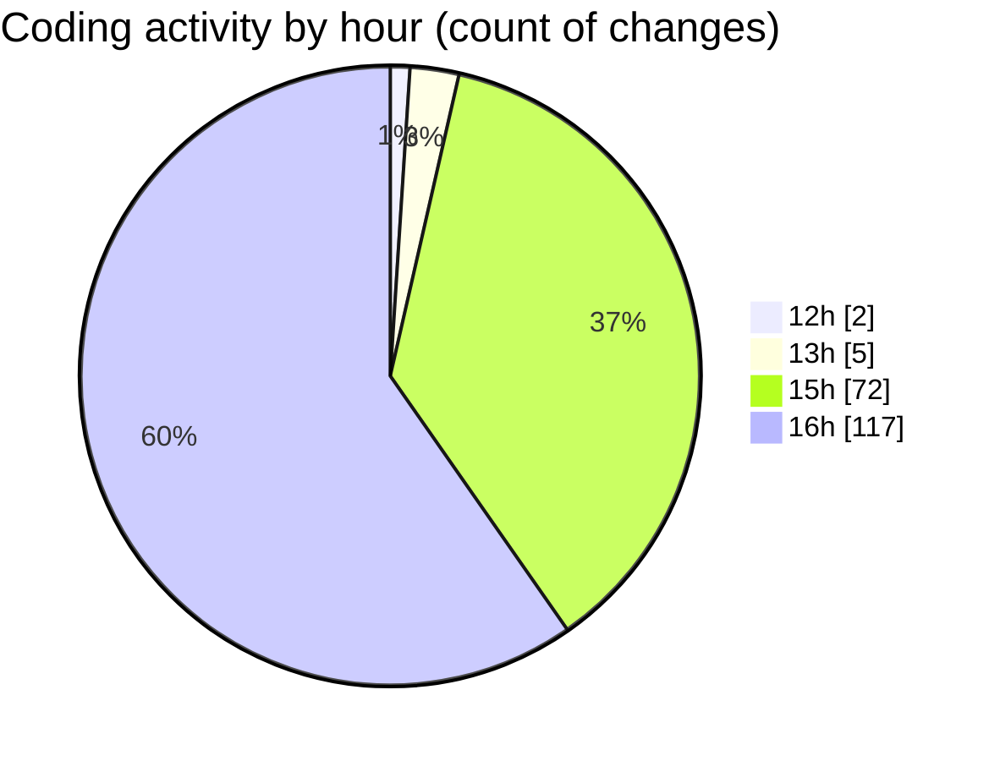

# fish - Activity Summary 

## Overall Statistics

| Stat                   | Value                                                             |
| ---------------------- | ----------------------------------------------------------------- |
| **Lines Added** (➕)   | 1853                                          |
| **Lines Removed** (➖) | 320                                        |
| **Net Change** (↕)    | 1533                |
| **Active Time** (⌚)   | 204 minutes |

## Modified Files
- **config.fish** (+39, -26)
- **config.old.fish** (+564, -203)
- **_start_ribbon_dev_server.fish** (+117, -0)
- **settings.json** (+519, -4)
- **COMMIT_EDITMSG** (+2, -0)
- **env.fish** (+71, -0)
- **init.fish** (+22, -0)
- **fish_prompt.fish** (+10, -0)
- **ll.fish** (+6, -0)
- **update.fish** (+11, -0)
- **x.fish** (+4, -0)
- **supermacrowhisper.fish** (+4, -0)
- **preload.fish** (+4, -0)
- **og.fish** (+4, -0)
- **oc.fish** (+4, -0)
- **cursor.fish** (+4, -0)
- **code.fish** (+4, -0)
- **c.fish** (+4, -0)
- **bun_cmd.fish** (+4, -0)
- **.z.fish** (+4, -0)
- **.w.fish** (+4, -0)
- **.r.fish** (+4, -0)
- **.ignore.fish** (+4, -0)
- **.gitignore.fish** (+4, -0)
- **.git.fish** (+4, -0)
- **.f.fish** (+4, -0)
- **.bun.fish** (+4, -0)
- **note.fish** (+26, -0)
- **bun.fish** (+38, -25)
- **unbun.fish** (+39, -19)
- **codex.fish** (+7, -0)
- **qlmodelids.fish** (+5, -0)
- **gemini_interactive.fish** (+57, -0)
- **rmd.fish** (+12, -0)
- **bun_update_all.fish** (+7, -0)
- **bun_downgrade_all.fish** (+4, -0)
- **opencode_bun.fish** (+4, -0)
- **opencode_go.fish** (+4, -0)
- **o.fish** (+4, -0)
- **i.fish** (+4, -0)
- **add.fish** (+4, -0)
- **ad.fish** (+4, -0)
- **a.fish** (+4, -0)
- **remove.fish** (+4, -0)
- **run.fish** (+4, -0)
- **start.fish** (+4, -0)
- **build.fish** (+4, -0)
- **tests.fish** (+4, -0)
- **check.fish** (+10, -6)
- **preview.fish** (+4, -0)
- **vc.fish** (+4, -0)
- **ggit.fish** (+4, -0)
- **ggitv.fish** (+4, -0)
- **ungit.fish** (+4, -0)
- **regit.fish** (+4, -0)
- **npx.fish** (+4, -0)
- **youtube-dl.fish** (+4, -0)
- **yt.fish** (+4, -0)
- **.superwhisper.fish** (+4, -0)
- **.sw.fish** (+4, -0)
- **.repomix.fish** (+4, -0)
- **.biome.fish** (+4, -0)
- **projects.fish** (+4, -0)
- **update_language_associations.fish** (+4, -0)
- **.codex.fish** (+4, -0)
- **.claude.fish** (+4, -0)
- **.c.fish** (+4, -0)
- **.mcp.fish** (+4, -0)
- **bot.fish** (+4, -0)
- **help.fish** (+4, -0)
- **gitg.fish** (+4, -0)
- **bang.fish** (+4, -0)
- **bangbang.fish** (+4, -0)
- **mcp.fish** (+4, -0)
- **mcp_alias.fish** (+39, -37)
- **u.fish** (+4, -0)
- **uf.fish** (+4, -0)
- **uc.fish** (+4, -0)
- **ui.fish** (+4, -0)
- **FIX.fish** (+4, -0)
- **bunup.fish** (+4, -0)
- **bunup-clean.fish** (+4, -0)
- **bundown.fish** (+4, -0)

## Visualizations

### By File Type (Lines Changed)

### By Hour (Estimated Activity Count)

> **Last Updated:** 12/07/2025, 16:13:15