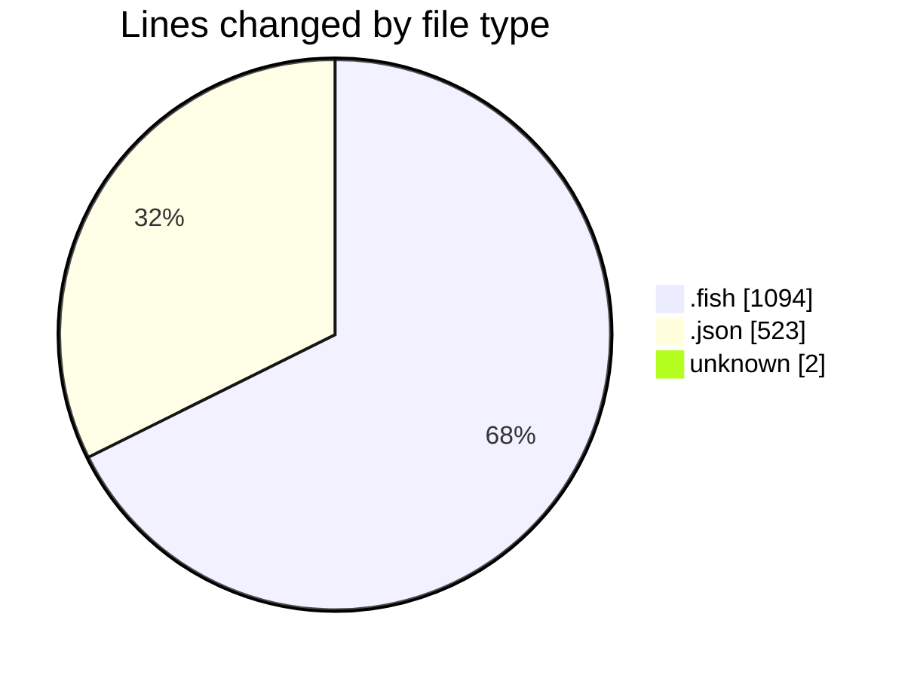
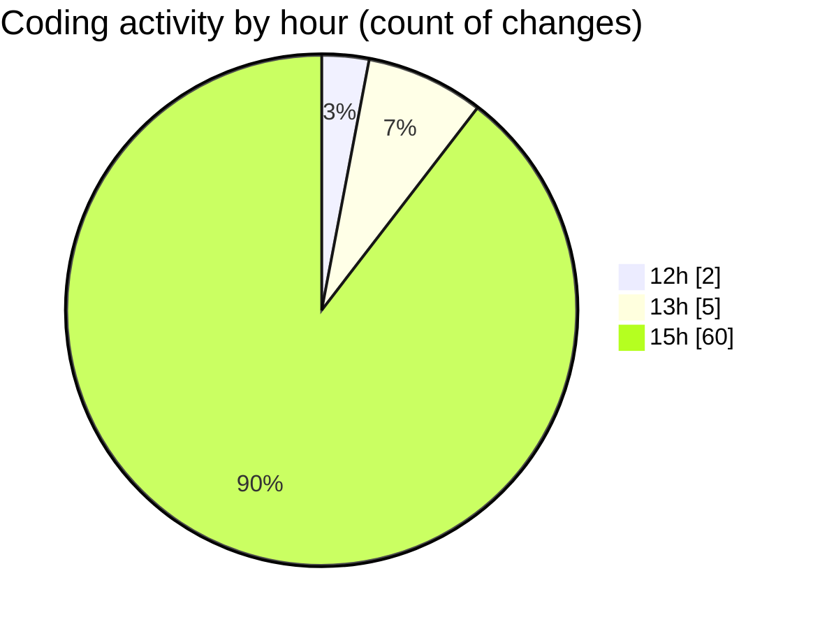

# fish - Activity Summary 

## Overall Statistics

| Stat                   | Value                                                             |
| ---------------------- | ----------------------------------------------------------------- |
| **Lines Added** (➕)   | 1386                                          |
| **Lines Removed** (➖) | 233                                        |
| **Net Change** (↕)    | 1153                |
| **Active Time** (⌚)   | 73 minutes |

## Modified Files
- **config.fish** (+39, -26)
- **config.old.fish** (+564, -203)
- **_start_ribbon_dev_server.fish** (+117, -0)
- **settings.json** (+519, -4)
- **COMMIT_EDITMSG** (+2, -0)
- **env.fish** (+28, -0)
- **init.fish** (+22, -0)
- **fish_prompt.fish** (+10, -0)
- **ll.fish** (+6, -0)
- **update.fish** (+11, -0)
- **x.fish** (+4, -0)
- **supermacrowhisper.fish** (+4, -0)
- **preload.fish** (+4, -0)
- **og.fish** (+4, -0)
- **oc.fish** (+4, -0)
- **cursor.fish** (+4, -0)
- **code.fish** (+4, -0)
- **c.fish** (+4, -0)
- **bun_cmd.fish** (+4, -0)
- **.z.fish** (+4, -0)
- **.w.fish** (+4, -0)
- **.r.fish** (+4, -0)
- **.ignore.fish** (+4, -0)
- **.gitignore.fish** (+4, -0)
- **.git.fish** (+4, -0)
- **.f.fish** (+4, -0)
- **.bun.fish** (+4, -0)

## Visualizations

### By File Type (Lines Changed)

### By Hour (Estimated Activity Count)

> **Last Updated:** 12/07/2025, 15:58:15