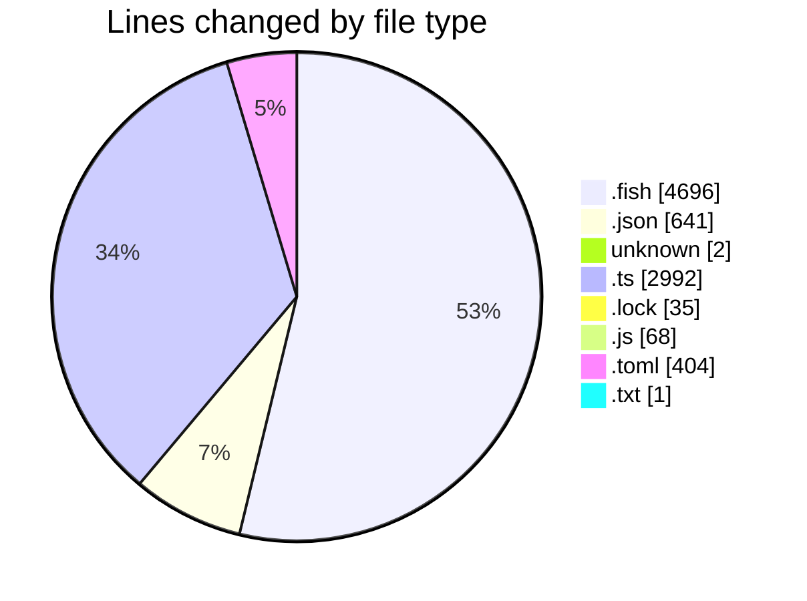
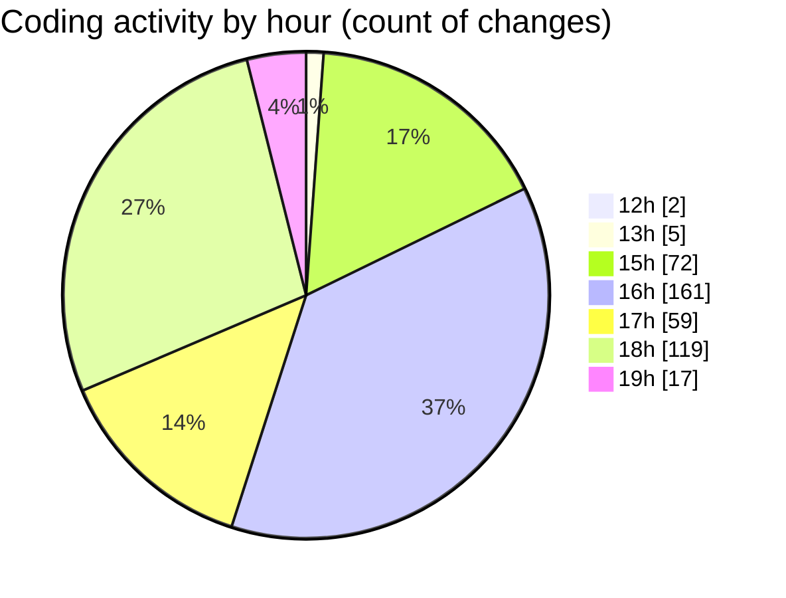

# fish - Activity Summary 

## Overall Statistics

| Stat                   | Value                                                             |
| ---------------------- | ----------------------------------------------------------------- |
| **Lines Added** (➕)   | 7813                                          |
| **Lines Removed** (➖) | 1026                                        |
| **Net Change** (↕)    | 6787                |
| **Active Time** (⌚)   | 445 minutes |

## Modified Files
- **config.fish** (+57, -41)
- **config.old.fish** (+564, -203)
- **_start_ribbon_dev_server.fish** (+123, -56)
- **settings.json** (+594, -5)
- **COMMIT_EDITMSG** (+2, -0)
- **env.fish** (+135, -15)
- **init.fish** (+22, -0)
- **fish_prompt.fish** (+22, -0)
- **ll.fish** (+6, -0)
- **update.fish** (+11, -0)
- **x.fish** (+4, -0)
- **supermacrowhisper.fish** (+4, -0)
- **preload.fish** (+4, -0)
- **og.fish** (+4, -0)
- **oc.fish** (+4, -0)
- **cursor.fish** (+4, -0)
- **code.fish** (+4, -0)
- **c.fish** (+4, -0)
- **bun_cmd.fish** (+4, -0)
- **.z.fish** (+4, -0)
- **.w.fish** (+4, -0)
- **.r.fish** (+4, -0)
- **.ignore.fish** (+4, -0)
- **.gitignore.fish** (+4, -0)
- **.git.fish** (+4, -0)
- **.f.fish** (+4, -0)
- **.bun.fish** (+4, -0)
- **note.fish** (+26, -0)
- **bun.fish** (+54, -40)
- **unbun.fish** (+58, -38)
- **codex.fish** (+13, -6)
- **qlmodelids.fish** (+5, -0)
- **gemini_interactive.fish** (+70, -56)
- **rmd.fish** (+23, -11)
- **bun_update_all.fish** (+14, -6)
- **bun_downgrade_all.fish** (+15, -3)
- **opencode_bun.fish** (+7, -3)
- **opencode_go.fish** (+7, -3)
- **o.fish** (+4, -0)
- **i.fish** (+4, -0)
- **add.fish** (+4, -0)
- **ad.fish** (+4, -0)
- **a.fish** (+4, -0)
- **remove.fish** (+4, -0)
- **run.fish** (+4, -0)
- **start.fish** (+4, -0)
- **build.fish** (+4, -0)
- **tests.fish** (+4, -0)
- **check.fish** (+10, -6)
- **preview.fish** (+4, -0)
- **vc.fish** (+4, -0)
- **ggit.fish** (+4, -0)
- **ggitv.fish** (+4, -0)
- **ungit.fish** (+4, -0)
- **regit.fish** (+4, -0)
- **npx.fish** (+4, -0)
- **youtube-dl.fish** (+4, -0)
- **yt.fish** (+4, -0)
- **.superwhisper.fish** (+4, -0)
- **.sw.fish** (+4, -0)
- **.repomix.fish** (+4, -0)
- **.biome.fish** (+4, -0)
- **projects.fish** (+4, -0)
- **update_language_associations.fish** (+7, -3)
- **.codex.fish** (+4, -0)
- **.claude.fish** (+4, -0)
- **.c.fish** (+4, -0)
- **.mcp.fish** (+4, -0)
- **bot.fish** (+4, -0)
- **help.fish** (+4, -0)
- **gitg.fish** (+4, -0)
- **bang.fish** (+4, -0)
- **bangbang.fish** (+4, -0)
- **mcp.fish** (+7, -3)
- **mcp_alias.fish** (+39, -37)
- **u.fish** (+4, -0)
- **uf.fish** (+4, -0)
- **uc.fish** (+4, -0)
- **ui.fish** (+4, -0)
- **FIX.fish** (+4, -0)
- **bunup.fish** (+4, -0)
- **bunup-clean.fish** (+4, -0)
- **bundown.fish** (+4, -0)
- **mcp.ts** (+490, -0)
- **mcp.json** (+26, -0)
- **mock-interceptor.d.ts** (+94, -0)
- **balanced-pool.d.ts** (+30, -0)
- **pool.d.ts** (+40, -0)
- **pool-stats.d.ts** (+20, -0)
- **retry-agent.d.ts** (+9, -0)
- **global-dispatcher.d.ts** (+10, -0)
- **mock-errors.d.ts** (+13, -0)
- **handlers.d.ts** (+16, -0)
- **client.d.ts** (+108, -0)
- **mock-pool.d.ts** (+26, -0)
- **mock-client.d.ts** (+26, -0)
- **env-http-proxy-agent.d.ts** (+22, -0)
- **agent.d.ts** (+32, -0)
- **header.d.ts** (+161, -0)
- **fetch.d.ts** (+211, -0)
- **retry-handler.d.ts** (+117, -0)
- **interceptors.d.ts** (+35, -0)
- **cookies.d.ts** (+31, -0)
- **index.d.ts** (+76, -0)
- **mock-agent.d.ts** (+66, -0)
- **errors.d.ts** (+172, -0)
- **h2c-client.d.ts** (+76, -0)
- **dispatcher.d.ts** (+282, -0)
- **diagnostics-channel.d.ts** (+67, -0)
- **formdata.d.ts** (+109, -0)
- **eventsource.d.ts** (+62, -0)
- **mock-call-history.d.ts** (+112, -0)
- **proxy-agent.d.ts** (+29, -0)
- **cache.d.ts** (+37, -0)
- **websocket.d.ts** (+185, -0)
- **api.d.ts** (+44, -0)
- **bun.lock** (+35, -0)
- **package.json** (+16, -0)
- **downgrade_global_bun_packages.ts** (+102, -0)
- **fetch_title.js** (+68, -0)
- **echo.ts** (+82, -0)
- **dot_aliases.fish** (+64, -0)
- **git_aliases.fish** (+20, -0)
- **bun_aliases.fish** (+52, -0)
- **bun_scripts.fish** (+47, -0)
- **dev_aliases.fish** (+20, -0)
- **dev_scripts.fish** (+64, -39)
- **ai_aliases.fish** (+8, -0)
- **ai_scripts.fish** (+76, -0)
- **aliases.fish** (+57, -0)
- **ultracite_aliases.fish** (+24, -0)
- **system_and_utils.fish** (+220, -49)
- **biome_aliases.fish** (+25, -23)
- **dev_scripts copy.fish** (+64, -0)
- **p.fish** (+95, -63)
- **third_person.fish** (+8, -0)
- **git.fish** (+113, -0)
- **_ai_github_helpers.fish** (+209, -0)
- **starship.toml** (+17, -0)
- **test-file-creation.txt** (+1, -0)
- **_abbreviations.fish** (+12, -0)
- **agent.fish** (+167, -16)
- **starship.toml** (+221, -166)
- **_aliases.fish** (+80, -24)
- **abbreviations.fish** (+12, -0)
- **aliases.fish** (+20, -0)
- **b.fish** (+23, -0)
- **ultracite_aliases.fish** (+8, -0)
- **g.fish** (+4, -0)
- **ai_aliases.fish** (+4, -0)
- **ga.fish** (+8, -0)
- **ai_get_repo_info.fish** (+4, -0)
- **ai_get_current_branch.fish** (+4, -0)
- **ai_git_flow.fish** (+21, -0)
- **ai_smart_commit.fish** (+16, -0)
- **ai_sync_branch.fish** (+6, -0)
- **ai_list_open_issues.fish** (+18, -0)
- **ai_get_pr_for_current_branch.fish** (+6, -0)
- **ai_batch_op.fish** (+19, -0)
- **ai_pr_checks.fish** (+11, -0)
- **ai_get_pr_diff.fish** (+11, -0)
- **ai_get_review_comments_for_file.fish** (+11, -0)
- **ai_repo_ctx.fish** (+4, -0)
- **ai_repo_structure.fish** (+12, -0)
- **ai_repo_stats.fish** (+7, -0)
- **ai_search_code.fish** (+8, -0)
- **ai_report_generate.fish** (+18, -0)
- **ai_workflow_execute.fish** (+17, -0)
- **ai_context_store.fish** (+29, -0)
- **bun_aliases.fish** (+16, -0)
- **dev.fish** (+8, -0)
- **git_aliases.fish** (+7, -0)
- **gp.fish** (+84, -0)
- **vdeploy.fish** (+23, -0)
- **vercel_aliases.fish** (+3, -0)
- **openrouter_list_keys.fish** (+13, -0)
- **openrouter_list_models.fish** (+13, -0)
- **to_json.fish** (+57, -0)
- **utility_aliases.fish** (+5, -0)
- **project_aliases.fish** (+3, -0)
- **dot_aliases.fish** (+18, -0)
- **ai_agent_config.fish** (+24, -0)
- **ghp.fish** (+113, -44)
- **repo.fish** (+177, -67)
- **openrouter.fish** (+24, -0)

## Visualizations

### By File Type (Lines Changed)

### By Hour (Estimated Activity Count)

> **Last Updated:** 12/07/2025, 19:59:25