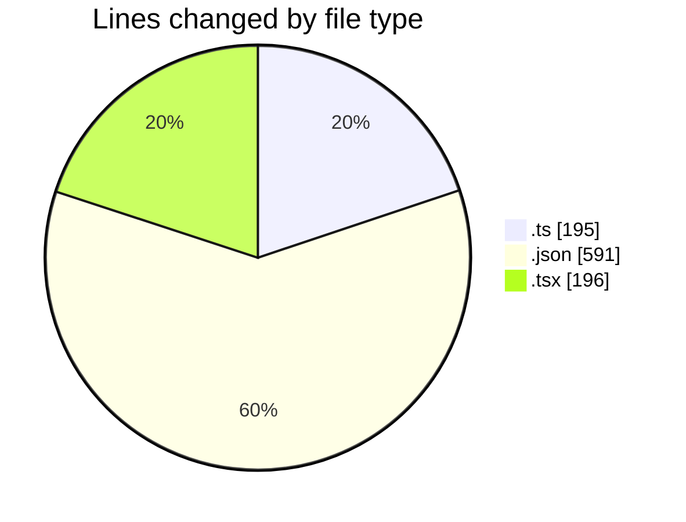
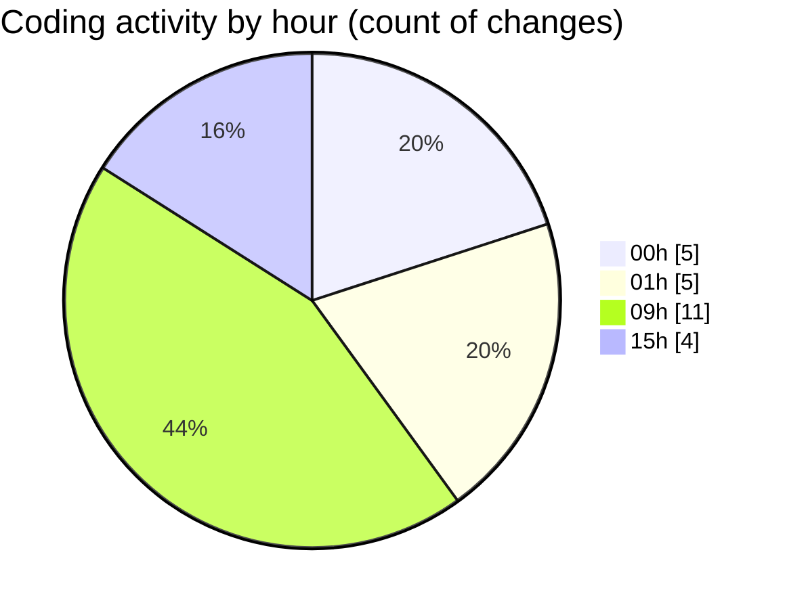

# ribbon - Activity Summary 

## Overall Statistics

| Stat                   | Value                                                             |
| ---------------------- | ----------------------------------------------------------------- |
| **Lines Added** (➕)   | 881                                          |
| **Lines Removed** (➖) | 101                                        |
| **Net Change** (↕)    | 780                |
| **Active Time** (⌚)   | 27 minutes |

## Modified Files
- **repopulate-demo-images.ts** (+91, -17)
- **mcp.json** (+57, -15)
- **settings.json** (+518, -1)
- **searchable-container.tsx** (+4, -40)
- **VirtualizedFinder.tsx** (+117, -5)
- **MaterialsFinder.tsx** (+12, -18)
- **portfolio-words.ts** (+13, -0)
- **rename-materials.ts** (+69, -5)

## Visualizations

### By File Type (Lines Changed)

### By Hour (Estimated Activity Count)

> **Last Updated:** 12/07/2025, 15:48:45