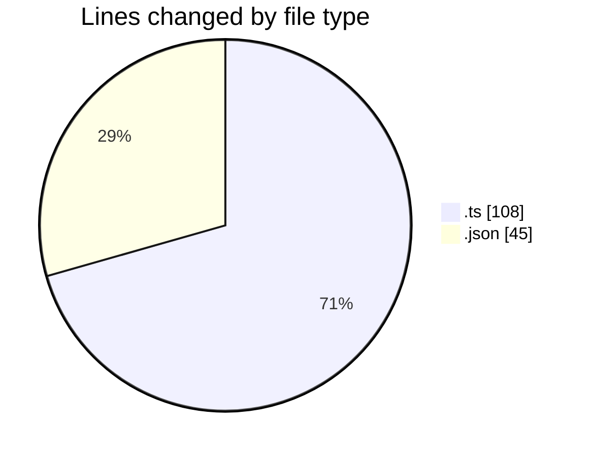
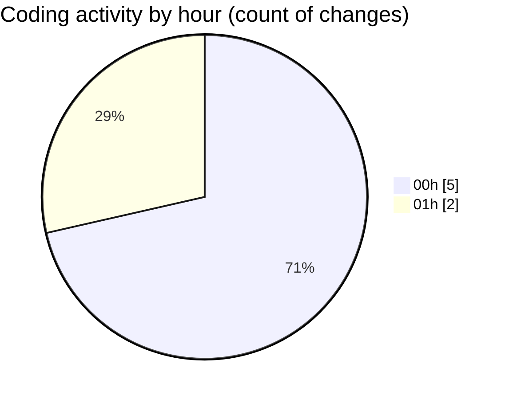

# ribbon - Activity Summary 

## Overall Statistics

| Stat                   | Value                                                             |
| ---------------------- | ----------------------------------------------------------------- |
| **Lines Added** (➕)   | 133                                          |
| **Lines Removed** (➖) | 20                                        |
| **Net Change** (↕)    | 113                |
| **Active Time** (⌚)   | 9 minutes |

## Modified Files
- **repopulate-demo-images.ts** (+91, -17)
- **mcp.json** (+42, -3)

## Visualizations

### By File Type (Lines Changed)

### By Hour (Estimated Activity Count)

> **Last Updated:** 12/07/2025, 01:33:44