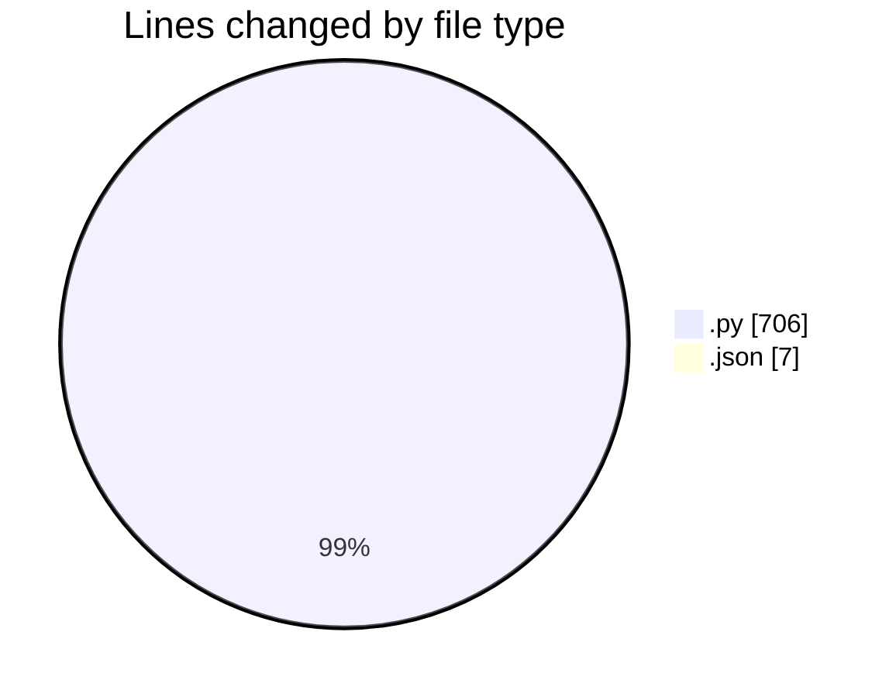
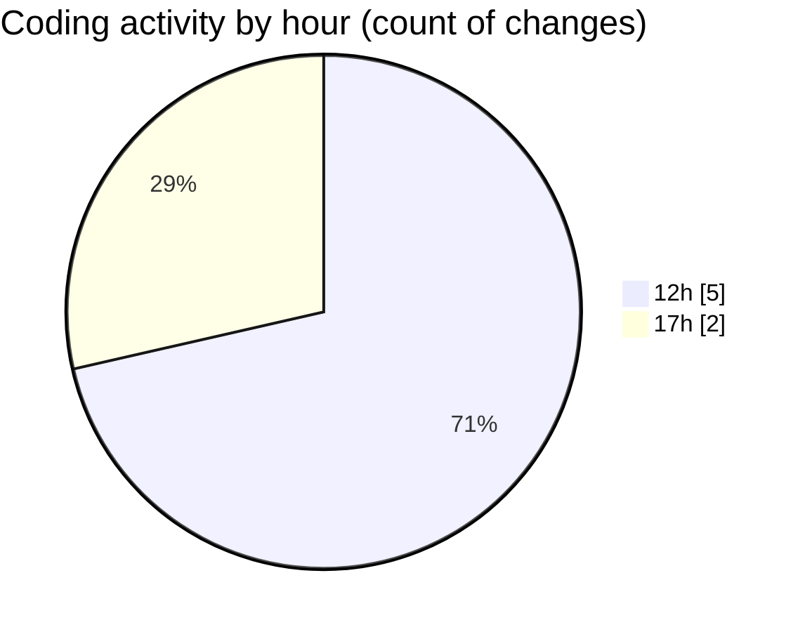

# ableton-mcp - Activity Summary 

## Overall Statistics

| Stat                   | Value                                                             |
| ---------------------- | ----------------------------------------------------------------- |
| **Lines Added** (➕)   | 693                                          |
| **Lines Removed** (➖) | 20                                        |
| **Net Change** (↕)    | 673                |
| **Active Time** (⌚)   | 5 minutes |

## Modified Files
- **server.py** (+665, -0)
- **test_types.py** (+21, -20)
- **mcp.json** (+7, -0)

## Visualizations

### By File Type (Lines Changed)

### By Hour (Estimated Activity Count)

> **Last Updated:** 13/07/2025, 17:58:47