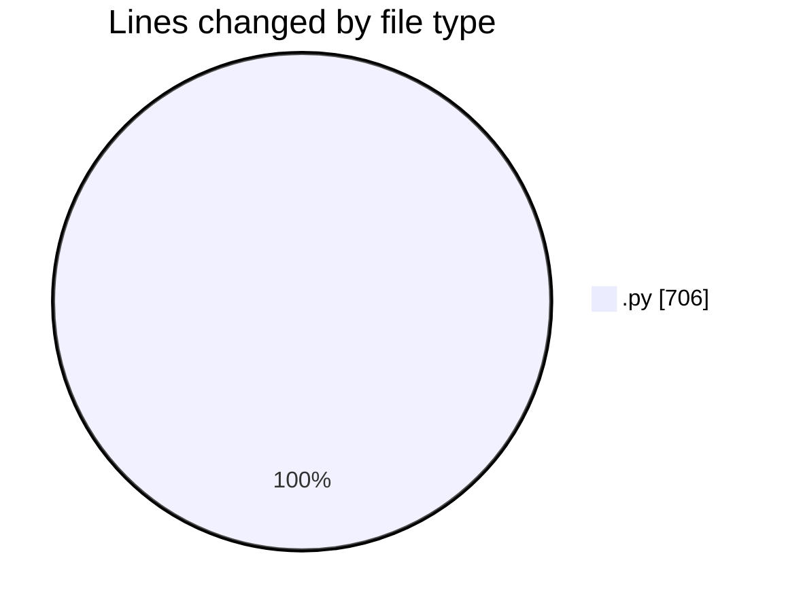
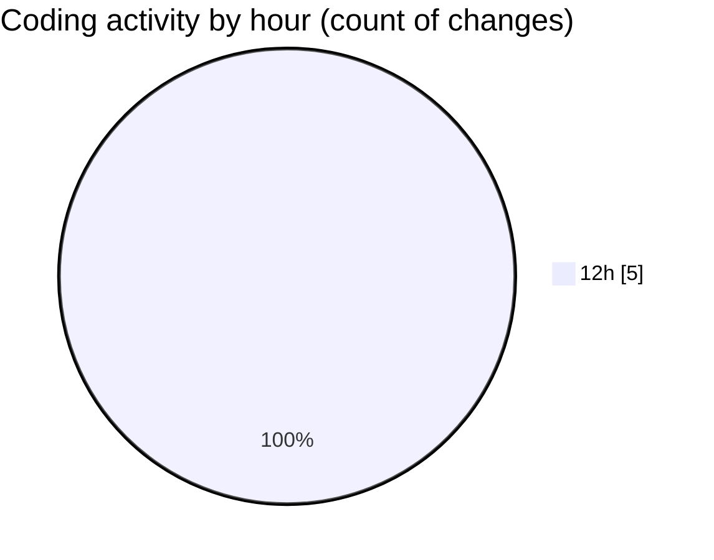

# ableton-mcp - Activity Summary 

## Overall Statistics

| Stat                   | Value                                                             |
| ---------------------- | ----------------------------------------------------------------- |
| **Lines Added** (➕)   | 686                                          |
| **Lines Removed** (➖) | 20                                        |
| **Net Change** (↕)    | 666                |
| **Active Time** (⌚)   | 4 minutes |

## Modified Files
- **server.py** (+665, -0)
- **test_types.py** (+21, -20)

## Visualizations

### By File Type (Lines Changed)

### By Hour (Estimated Activity Count)

> **Last Updated:** 13/07/2025, 12:23:46