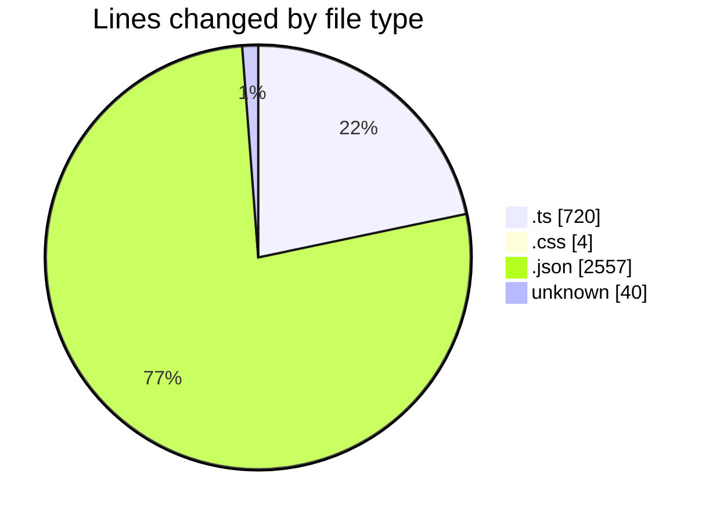
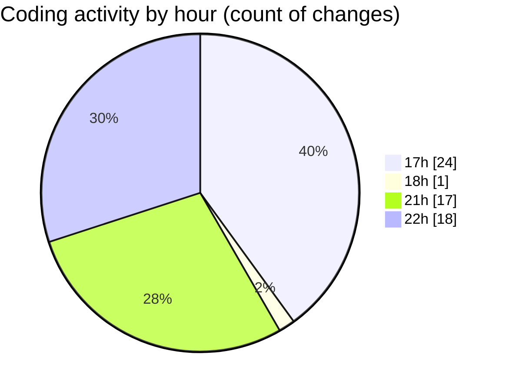

# tampermonkey - Activity Summary 

## Overall Statistics

| Stat                   | Value                                                             |
| ---------------------- | ----------------------------------------------------------------- |
| **Lines Added** (➕)   | 3272                                          |
| **Lines Removed** (➖) | 49                                        |
| **Net Change** (↕)    | 3223                |
| **Active Time** (⌚)   | 71 minutes |

## Modified Files
- **index.ts** (+1, -0)
- **meta.ts** (+10, -0)
- **style.css** (+4, -0)
- **index.ts** (+17, -3)
- **tsconfig.json** (+30, -0)
- **build.ts** (+77, -0)
- **package.json** (+17, -0)
- **deploy.ts** (+115, -0)
- **gists.json** (+5, -2)
- **.gitignore** (+38, -0)
- **settings.json** (+1247, -38)
- **.env** (+2, -0)
- **mcp.ts** (+497, -0)
- **keybindings.json** (+1212, -6)

## Visualizations

### By File Type (Lines Changed)

### By Hour (Estimated Activity Count)

> **Last Updated:** 13/07/2025, 22:29:17