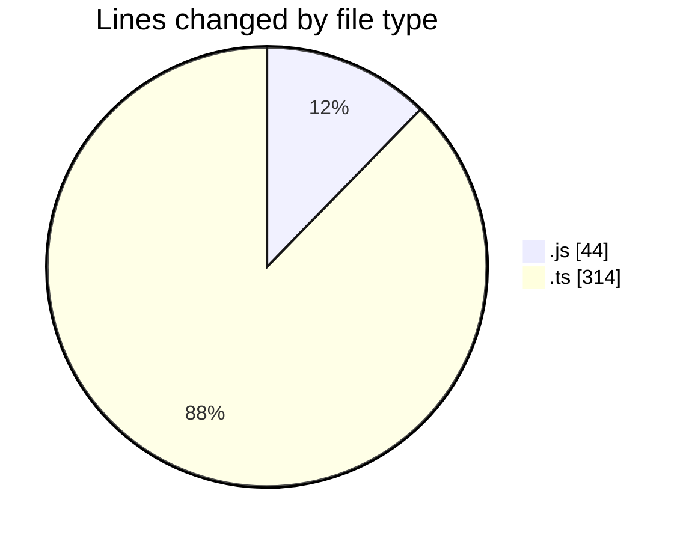

# ribbon - Activity Summary 

## Overall Statistics

| Stat                   | Value                                                             |
| ---------------------- | ----------------------------------------------------------------- |
| **Lines Added** (➕)   | 358                                          |
| **Lines Removed** (➖) | 0                                        |
| **Net Change** (↕)    | 358                |
| **Active Time** (⌚)   | 10 minutes |

## Modified Files
- **tst.js** (+44, -0)
- **db-utils.ts** (+314, -0)

## Visualizations

### By File Type (Lines Changed)

### By Hour (Estimated Activity Count)

> **Last Updated:** 14/07/2025, 06:22:42