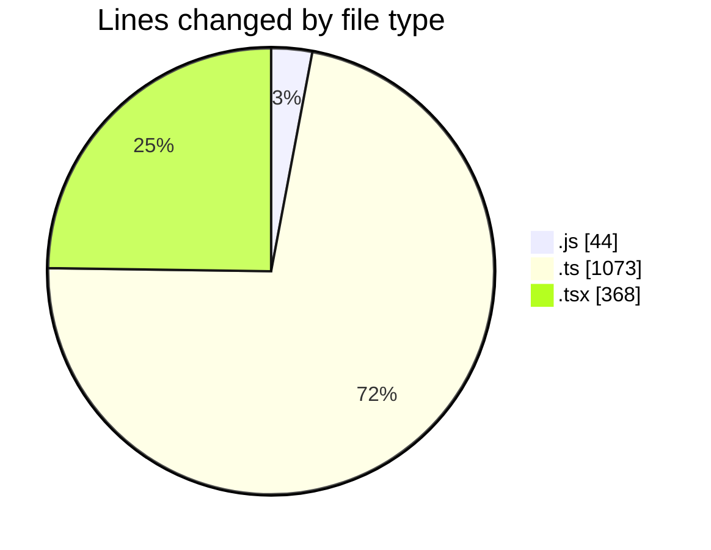
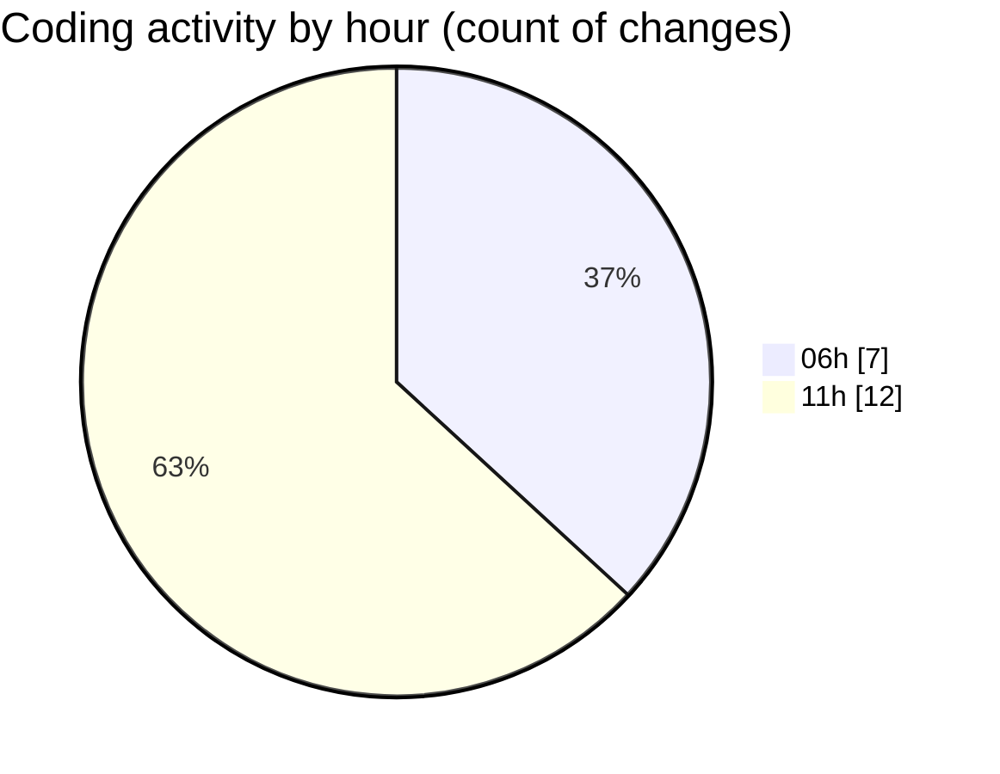

# ribbon - Activity Summary 

## Overall Statistics

| Stat                   | Value                                                             |
| ---------------------- | ----------------------------------------------------------------- |
| **Lines Added** (➕)   | 1482                                          |
| **Lines Removed** (➖) | 3                                        |
| **Net Change** (↕)    | 1479                |
| **Active Time** (⌚)   | 16 minutes |

## Modified Files
- **tst.js** (+44, -0)
- **db-utils.ts** (+314, -0)
- **page.tsx** (+15, -3)
- **getSignedImageVariants.ts** (+67, -0)
- **useImageLoading.tsx** (+51, -0)
- **materials.ts** (+692, -0)
- **MaterialsFinder.tsx** (+171, -0)
- **searchable-container.tsx** (+128, -0)

## Visualizations

### By File Type (Lines Changed)

### By Hour (Estimated Activity Count)

> **Last Updated:** 14/07/2025, 11:53:29