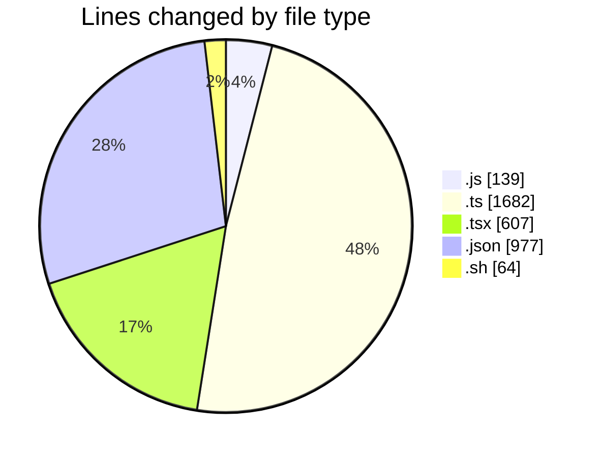
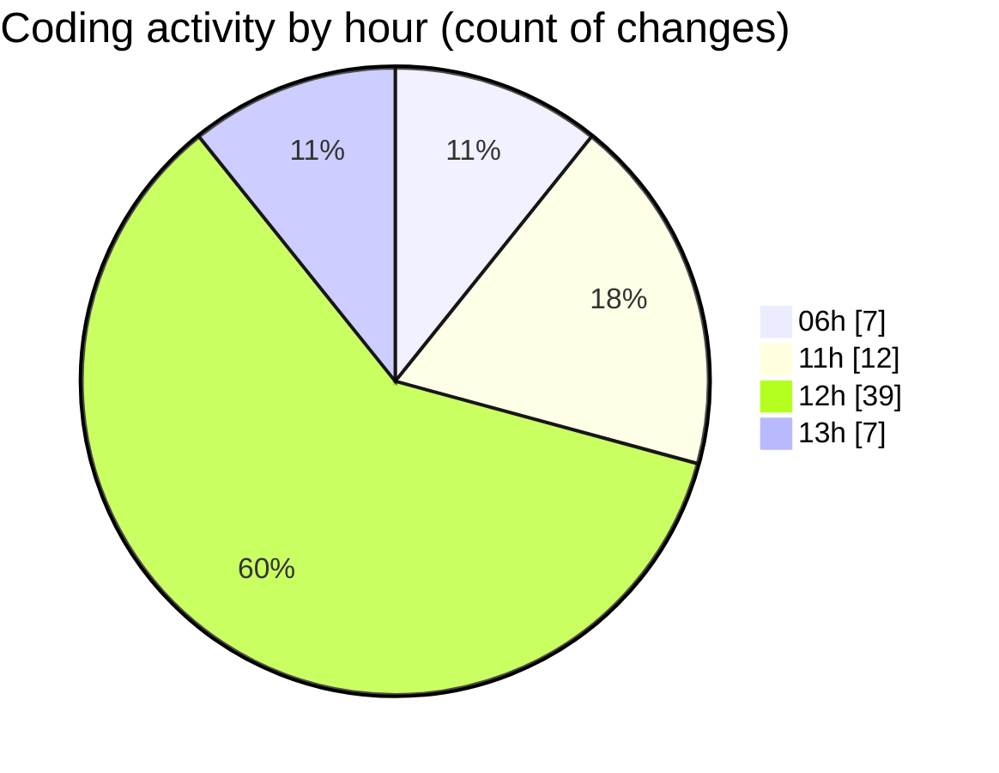

# ribbon - Activity Summary 

## Overall Statistics

| Stat                   | Value                                                             |
| ---------------------- | ----------------------------------------------------------------- |
| **Lines Added** (➕)   | 3380                                          |
| **Lines Removed** (➖) | 89                                        |
| **Net Change** (↕)    | 3291                |
| **Active Time** (⌚)   | 68 minutes |

## Modified Files
- **tst.js** (+44, -0)
- **db-utils.ts** (+314, -0)
- **page.tsx** (+15, -3)
- **getSignedImageVariants.ts** (+67, -0)
- **useImageLoading.tsx** (+51, -0)
- **materials.ts** (+692, -21)
- **MaterialsFinder.tsx** (+171, -2)
- **searchable-container.tsx** (+132, -0)
- **db-utils.ts** (+338, -0)
- **package.json** (+352, -48)
- **.eslintrc.js** (+47, -8)
- **useImageLoading.test.ts** (+60, -0)
- **portfolioWords.test.ts** (+41, -0)
- **dbUtils.test.ts** (+48, -0)
- **dependencies.test.sh** (+64, -0)
- **jest.config.js** (+33, -7)
- **setup.ts** (+51, -0)
- **settings.json** (+534, -0)
- **tsconfig.json** (+43, -0)
- **MaterialSelector.tsx** (+99, -0)
- **searchable-materials.tsx** (+104, -0)
- **useSearchMaterials.tsx** (+30, -0)
- **materialSearch.ts** (+50, -0)

## Visualizations

### By File Type (Lines Changed)

### By Hour (Estimated Activity Count)

> **Last Updated:** 14/07/2025, 13:23:29