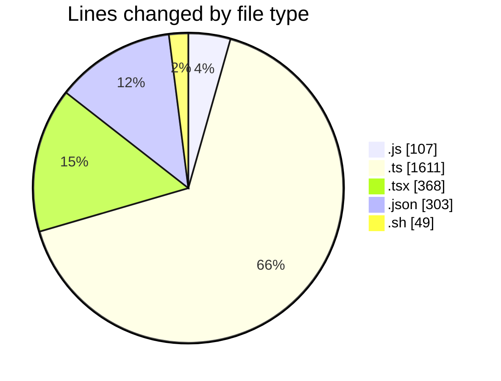
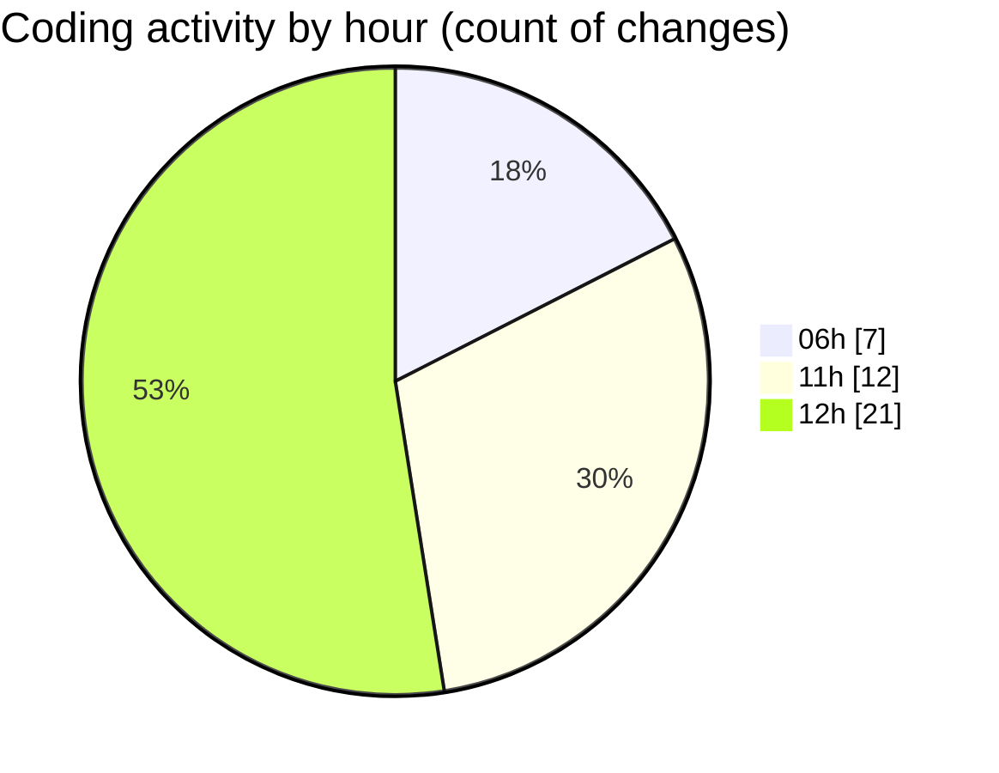

# ribbon - Activity Summary 

## Overall Statistics

| Stat                   | Value                                                             |
| ---------------------- | ----------------------------------------------------------------- |
| **Lines Added** (➕)   | 2434                                          |
| **Lines Removed** (➖) | 4                                        |
| **Net Change** (↕)    | 2430                |
| **Active Time** (⌚)   | 38 minutes |

## Modified Files
- **tst.js** (+44, -0)
- **db-utils.ts** (+314, -0)
- **page.tsx** (+15, -3)
- **getSignedImageVariants.ts** (+67, -0)
- **useImageLoading.tsx** (+51, -0)
- **materials.ts** (+692, -0)
- **MaterialsFinder.tsx** (+171, -0)
- **searchable-container.tsx** (+128, -0)
- **db-utils.ts** (+338, -0)
- **package.json** (+302, -1)
- **.eslintrc.js** (+31, -0)
- **useImageLoading.test.ts** (+60, -0)
- **portfolioWords.test.ts** (+41, -0)
- **dbUtils.test.ts** (+48, -0)
- **dependencies.test.sh** (+49, -0)
- **jest.config.js** (+32, -0)
- **setup.ts** (+51, -0)

## Visualizations

### By File Type (Lines Changed)

### By Hour (Estimated Activity Count)

> **Last Updated:** 14/07/2025, 12:28:29