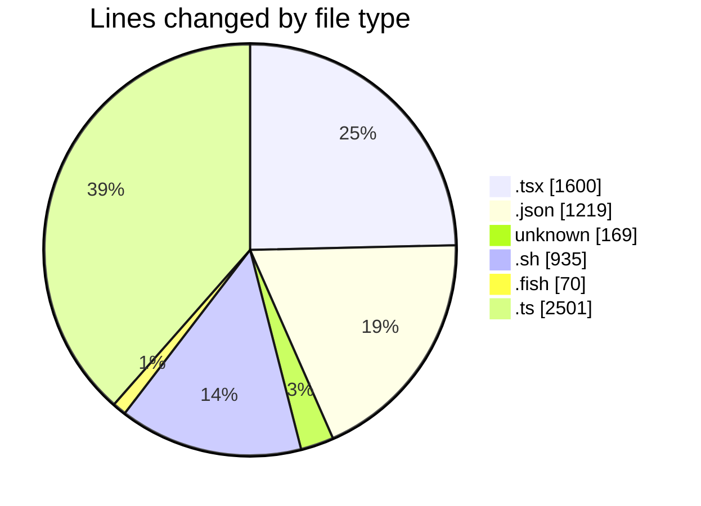
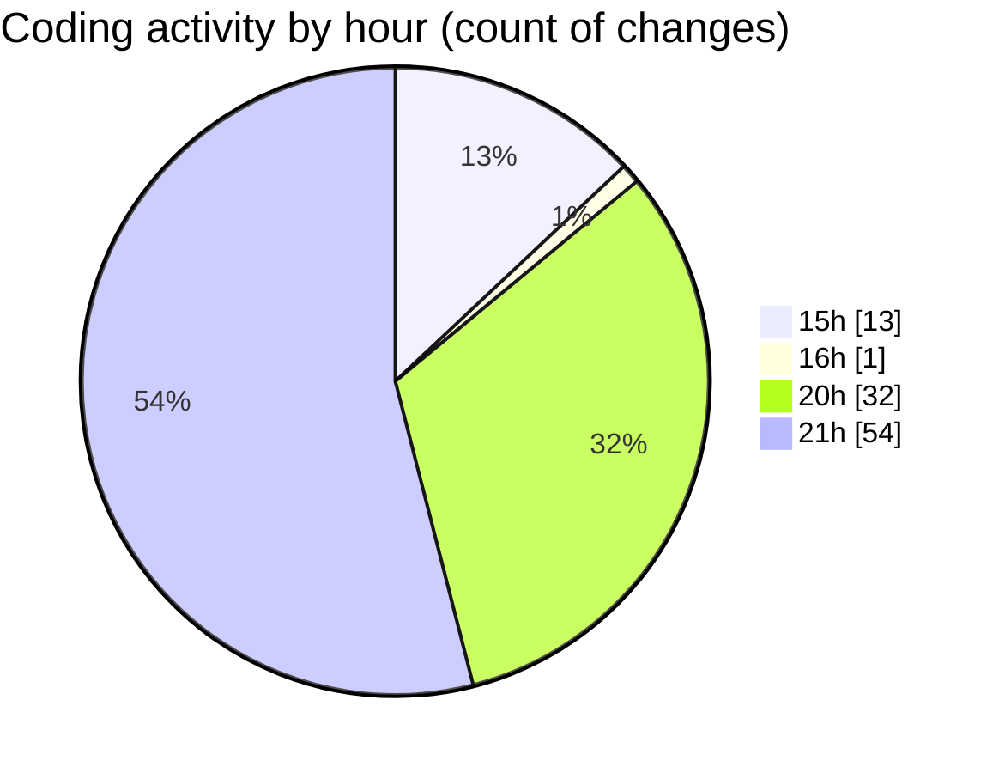

# ribbon - Activity Summary 

## Overall Statistics

| Stat                   | Value                                                             |
| ---------------------- | ----------------------------------------------------------------- |
| **Lines Added** (➕)   | 5914                                          |
| **Lines Removed** (➖) | 580                                        |
| **Net Change** (↕)    | 5334                |
| **Active Time** (⌚)   | 141 minutes |

## Modified Files
- **layout.tsx** (+147, -0)
- **package.json** (+645, -35)
- **useImageLoading.tsx** (+102, -0)
- **PreviewProjectPageButton.tsx** (+27, -0)
- **.cursorrules** (+48, -0)
- **useAvailableProjects.tsx** (+49, -0)
- **CreateKeyDialog.tsx** (+193, -0)
- **MaterialsFinder.tsx** (+377, -38)
- **searchable-container.tsx** (+248, -0)
- **page.tsx** (+76, -10)
- **settings.json** (+539, -0)
- **discover_routes.sh** (+32, -31)
- **discover_routes.fish** (+36, -34)
- **searchable-materials.tsx** (+106, -1)
- **discover_routes_with_ids.sh** (+123, -122)
- **get_real_ids.ts** (+80, -0)
- **discover_routes_populated.sh** (+137, -136)
- **discover_routes_dynamic.sh** (+168, -167)
- **discover_routes_dynamic.ts** (+128, -5)
- **preload_routes.ts** (+133, -1)
- **preload_app.sh** (+19, -0)
- **route_manager.ts** (+257, -0)
- **.gitignore_global** (+121, -0)
- **preload.ts** (+257, -0)
- **prerender.ts** (+257, -0)
- **dev-performance-test.ts** (+219, -0)
- **quick-dev-test.ts** (+153, -0)
- **page.tsx** (+11, -0)
- **MaterialSelector.tsx** (+102, -0)
- **materials.ts** (+642, -0)
- **material.ts** (+357, -0)
- **index.ts** (+12, -0)
- **EditMaterials.tsx** (+21, -0)
- **Sheet.tsx** (+92, -0)

## Visualizations

### By File Type (Lines Changed)

### By Hour (Estimated Activity Count)

> **Last Updated:** 17/07/2025, 21:44:34