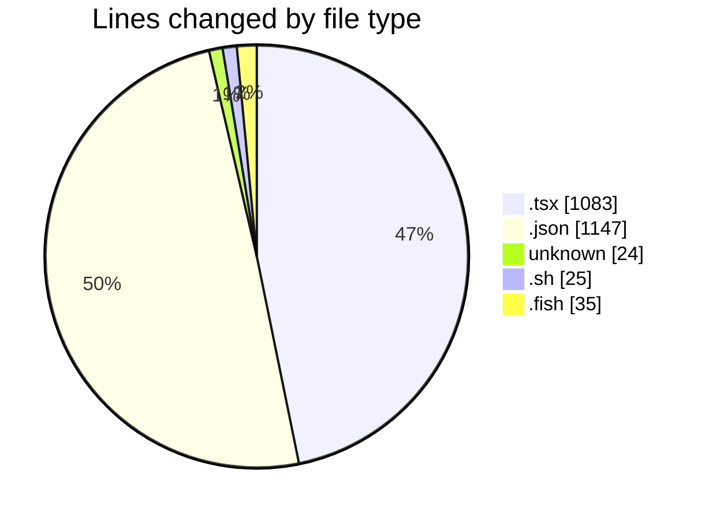
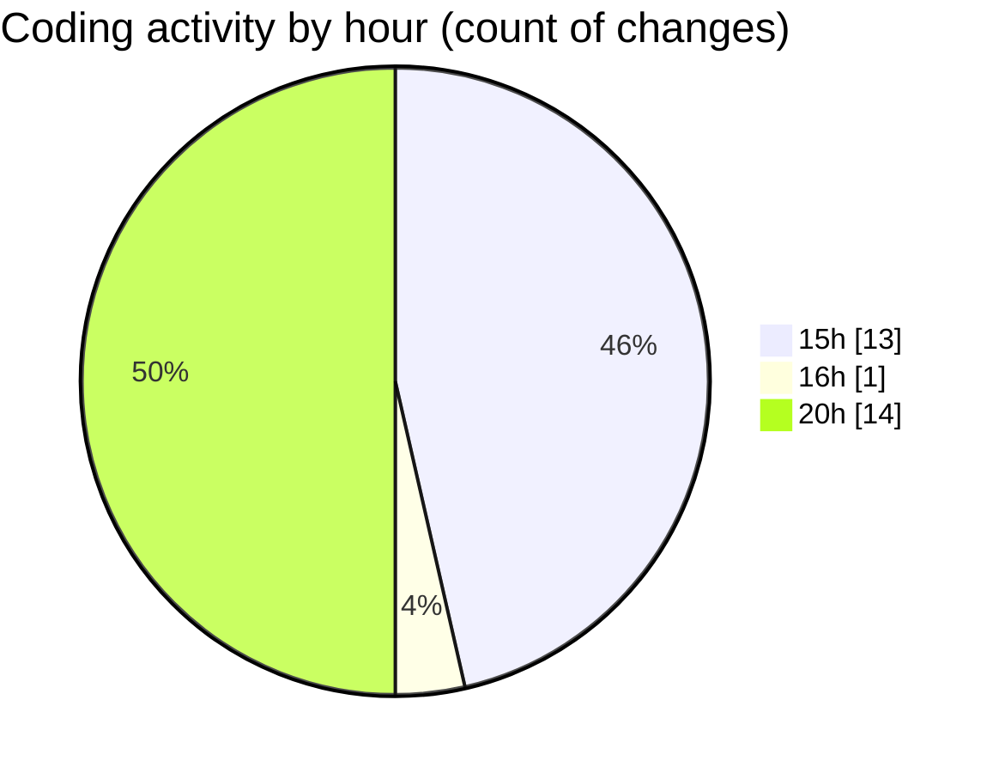

# ribbon - Activity Summary 

## Overall Statistics

| Stat                   | Value                                                             |
| ---------------------- | ----------------------------------------------------------------- |
| **Lines Added** (➕)   | 2311                                          |
| **Lines Removed** (➖) | 3                                        |
| **Net Change** (↕)    | 2308                |
| **Active Time** (⌚)   | 39 minutes |

## Modified Files
- **layout.tsx** (+147, -0)
- **package.json** (+608, -0)
- **useImageLoading.tsx** (+51, -0)
- **PreviewProjectPageButton.tsx** (+27, -0)
- **.cursorrules** (+24, -0)
- **useAvailableProjects.tsx** (+49, -0)
- **CreateKeyDialog.tsx** (+193, -0)
- **MaterialsFinder.tsx** (+340, -1)
- **searchable-container.tsx** (+124, -0)
- **page.tsx** (+44, -0)
- **settings.json** (+539, -0)
- **discover_routes.sh** (+25, -0)
- **discover_routes.fish** (+34, -1)
- **searchable-materials.tsx** (+106, -1)

## Visualizations

### By File Type (Lines Changed)

### By Hour (Estimated Activity Count)

> **Last Updated:** 17/07/2025, 20:44:34