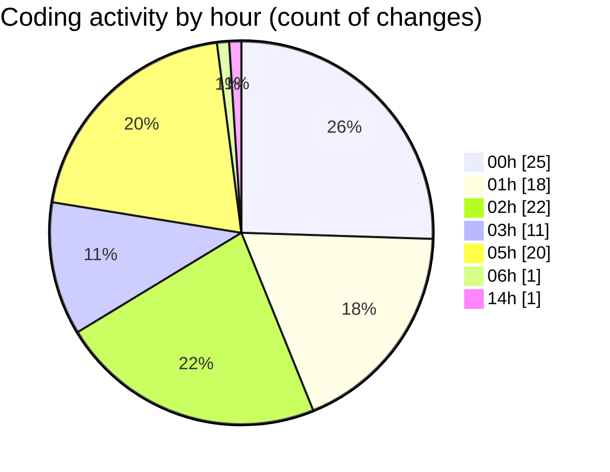

# ribbon - Activity Summary 

## Overall Statistics

| Stat                   | Value                                                             |
| ---------------------- | ----------------------------------------------------------------- |
| **Lines Added** (➕)   | 1450                                          |
| **Lines Removed** (➖) | 480                                        |
| **Net Change** (↕)    | 970                |
| **Active Time** (⌚)   | 132 minutes |

## Modified Files
- **test.svg** (+23, -1)
- **page.tsx** (+52, -91)
- **all.mdc** (+30, -4)
- **globals.css** (+14, -6)
- **tailwind.config.ts** (+3, -0)
- **searchable-container.tsx** (+614, -376)
- **MaterialsFinder.tsx** (+169, -0)
- **settings.json** (+545, -2)

## Visualizations

### By File Type (Lines Changed)

### By Hour (Estimated Activity Count)

> **Last Updated:** 18/07/2025, 14:49:33