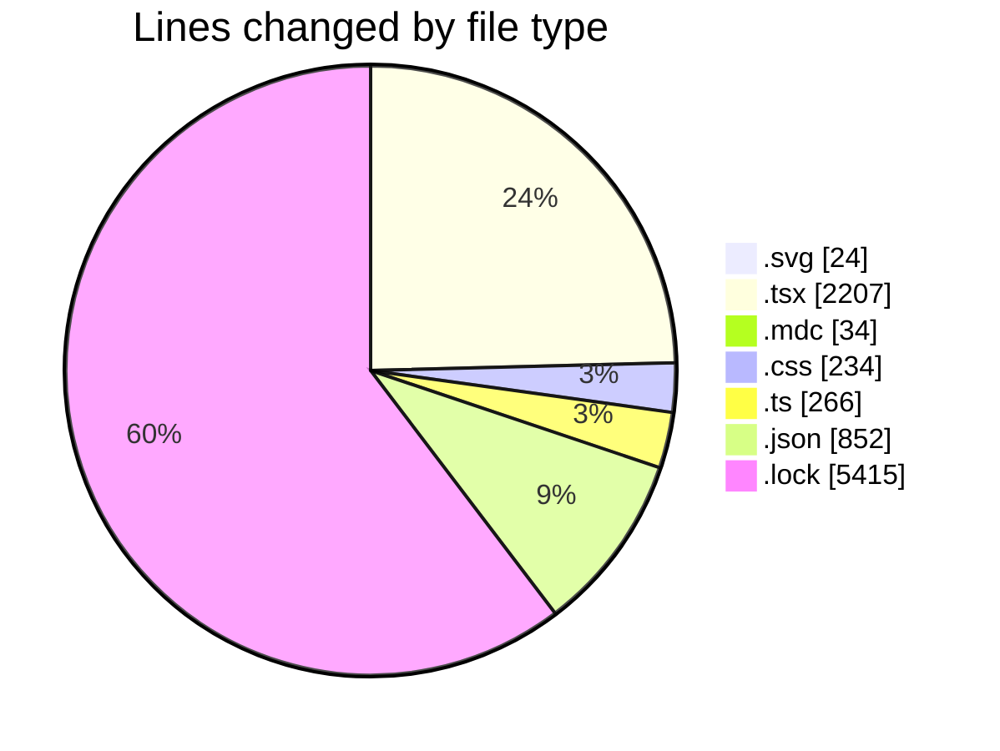
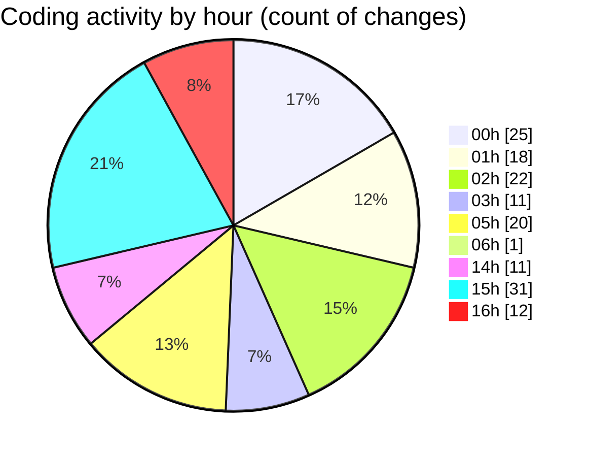

# ribbon - Activity Summary 

## Overall Statistics

| Stat                   | Value                                                             |
| ---------------------- | ----------------------------------------------------------------- |
| **Lines Added** (➕)   | 8446                                          |
| **Lines Removed** (➖) | 586                                        |
| **Net Change** (↕)    | 7860                |
| **Active Time** (⌚)   | 199 minutes |

## Modified Files
- **test.svg** (+23, -1)
- **page.tsx** (+72, -91)
- **all.mdc** (+30, -4)
- **globals.css** (+228, -6)
- **tailwind.config.ts** (+212, -1)
- **searchable-container.tsx** (+708, -467)
- **MaterialsFinder.tsx** (+173, -5)
- **settings.json** (+546, -2)
- **layout.tsx** (+147, -0)
- **AssetCard.tsx** (+264, -0)
- **ImportCard.tsx** (+41, -0)
- **getActivePersonId.ts** (+53, -0)
- **package.json** (+304, -0)
- **bun.lock** (+5415, -0)
- **searchable-materials.tsx** (+106, -0)
- **VirtualizedFinder.tsx** (+124, -9)

## Visualizations

### By File Type (Lines Changed)

### By Hour (Estimated Activity Count)

> **Last Updated:** 18/07/2025, 16:09:33