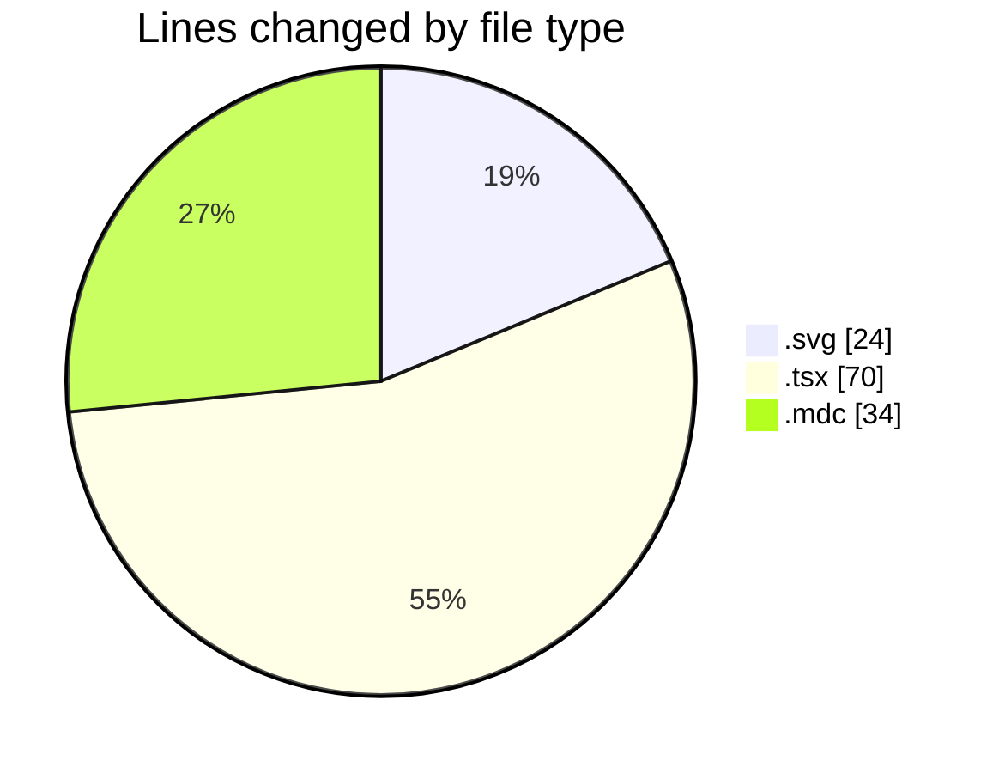

# ribbon - Activity Summary 

## Overall Statistics

| Stat                   | Value                                                             |
| ---------------------- | ----------------------------------------------------------------- |
| **Lines Added** (➕)   | 96                                          |
| **Lines Removed** (➖) | 32                                        |
| **Net Change** (↕)    | 64                |
| **Active Time** (⌚)   | 27 minutes |

## Modified Files
- **test.svg** (+23, -1)
- **page.tsx** (+43, -27)
- **all.mdc** (+30, -4)

## Visualizations

### By File Type (Lines Changed)

### By Hour (Estimated Activity Count)

> **Last Updated:** 18/07/2025, 00:59:34