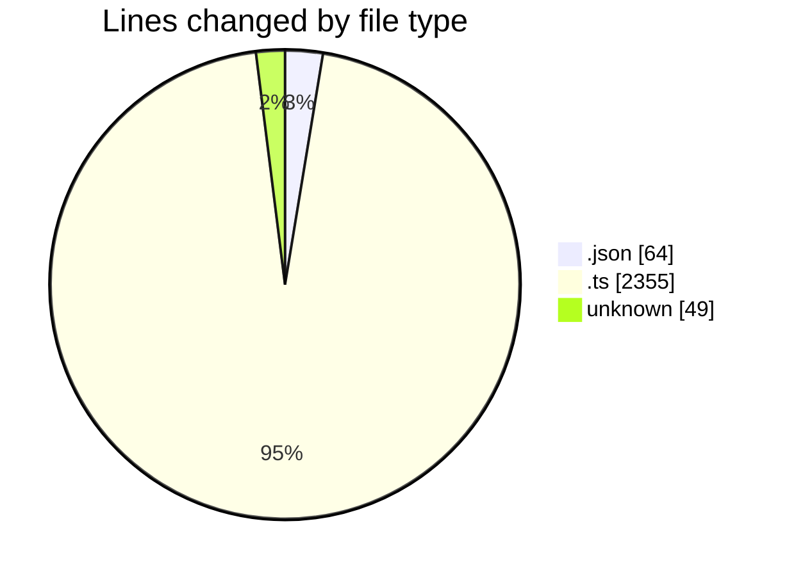
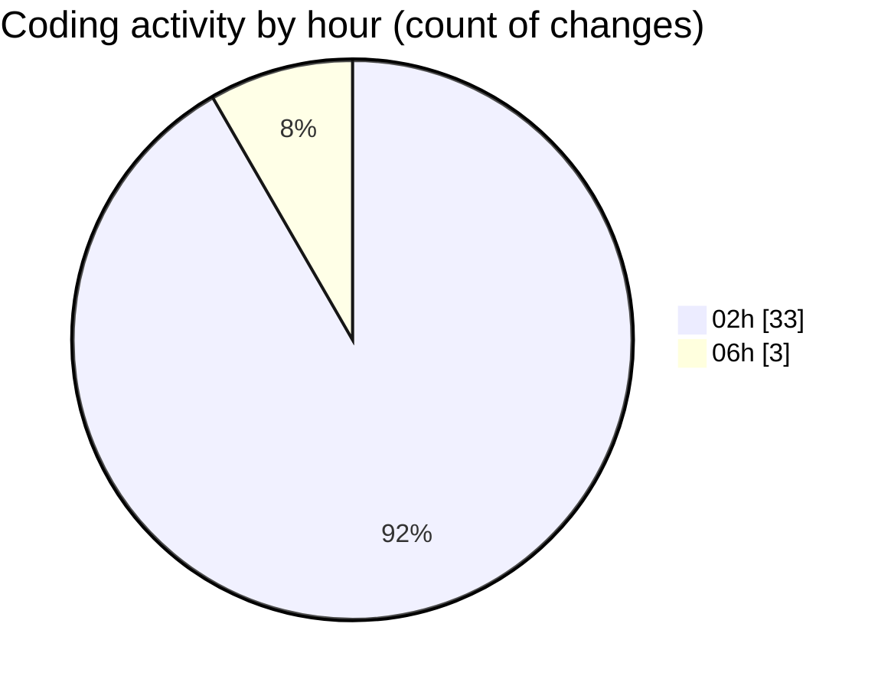

# defer-theme - Activity Summary 

## Overall Statistics

| Stat                   | Value                                                             |
| ---------------------- | ----------------------------------------------------------------- |
| **Lines Added** (➕)   | 2444                                          |
| **Lines Removed** (➖) | 24                                        |
| **Net Change** (↕)    | 2420                |
| **Active Time** (⌚)   | 37 minutes |

## Modified Files
- **manifest.json** (+64, -0)
- **errors.d.ts** (+172, -0)
- **mock-errors.d.ts** (+13, -0)
- **jsx-runtime.d.ts** (+37, -0)
- **pool.d.ts** (+40, -0)
- **formdata.d.ts** (+109, -0)
- **client.d.ts** (+108, -0)
- **header.d.ts** (+161, -0)
- **dispatcher.d.ts** (+282, -0)
- **pool-stats.d.ts** (+20, -0)
- **balanced-pool.d.ts** (+30, -0)
- **global-dispatcher.d.ts** (+10, -0)
- **retry-agent.d.ts** (+9, -0)
- **agent.d.ts** (+32, -0)
- **h2c-client.d.ts** (+76, -0)
- **mock-call-history.d.ts** (+112, -0)
- **api.d.ts** (+44, -0)
- **handlers.d.ts** (+16, -0)
- **fetch.d.ts** (+211, -0)
- **mock-pool.d.ts** (+26, -0)
- **mock-interceptor.d.ts** (+94, -0)
- **mock-agent.d.ts** (+66, -0)
- **websocket.d.ts** (+185, -0)
- **proxy-agent.d.ts** (+29, -0)
- **cache.d.ts** (+37, -0)
- **cookies.d.ts** (+31, -0)
- **interceptors.d.ts** (+35, -0)
- **diagnostics-channel.d.ts** (+67, -0)
- **retry-handler.d.ts** (+117, -0)
- **mock-client.d.ts** (+26, -0)
- **eventsource.d.ts** (+62, -0)
- **index.d.ts** (+76, -0)
- **env-http-proxy-agent.d.ts** (+22, -0)
- **Untitled-1** (+25, -24)

## Visualizations

### By File Type (Lines Changed)

### By Hour (Estimated Activity Count)

> **Last Updated:** 20/07/2025, 06:06:31