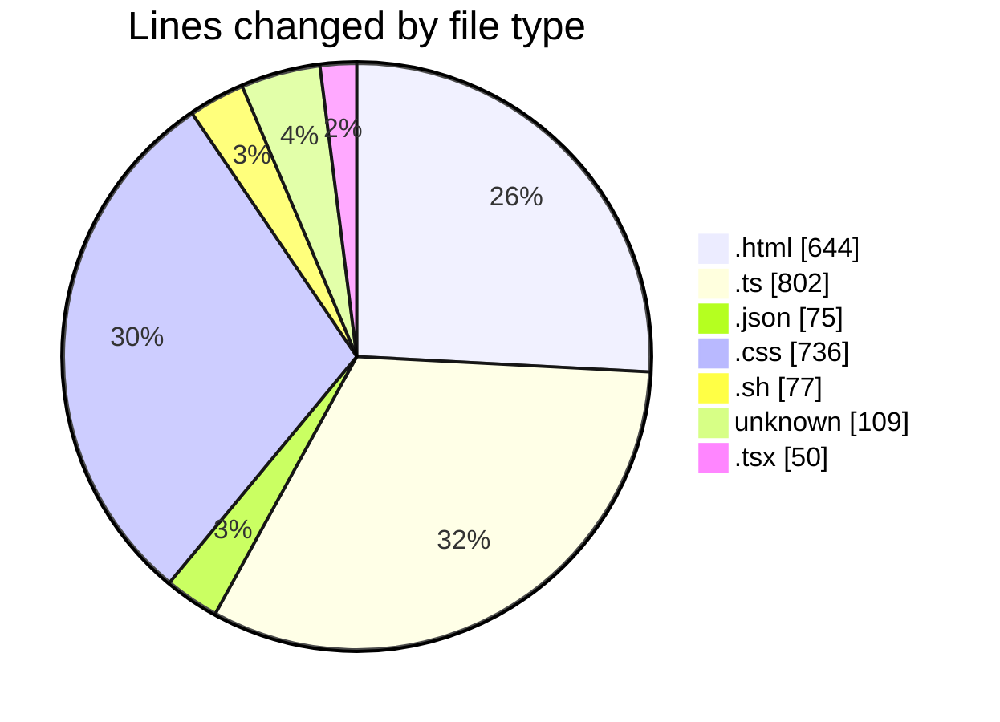
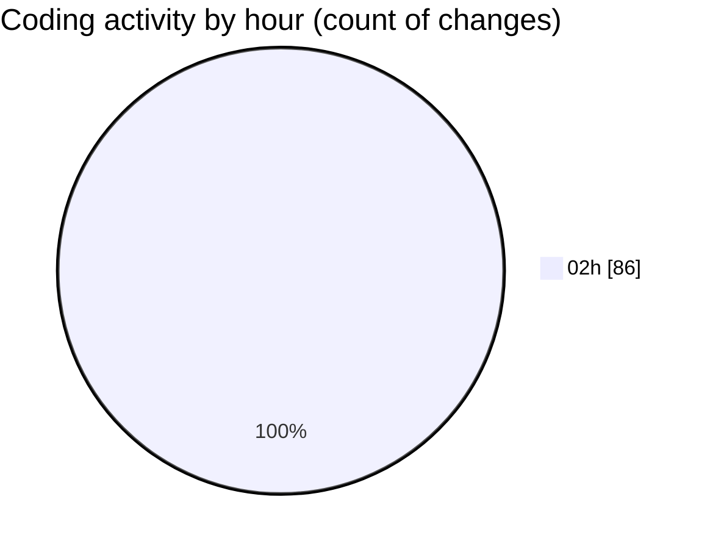

# defer - Activity Summary 

## Overall Statistics

| Stat                   | Value                                                             |
| ---------------------- | ----------------------------------------------------------------- |
| **Lines Added** (➕)   | 1707                                          |
| **Lines Removed** (➖) | 786                                        |
| **Net Change** (↕)    | 921                |
| **Active Time** (⌚)   | 88 minutes |

## Modified Files
- **defer.html** (+49, -31)
- **index.ts** (+168, -11)
- **package.json** (+39, -6)
- **frontend.ts** (+383, -202)
- **tsconfig.json** (+30, -0)
- **vite.config.ts** (+31, -7)
- **defer.css** (+154, -0)
- **index.html** (+289, -275)
- **style.css** (+368, -214)
- **dev.sh** (+50, -27)
- **.gitignore** (+109, -0)
- **App.tsx** (+26, -13)
- **main.tsx** (+11, -0)

## Visualizations

### By File Type (Lines Changed)

### By Hour (Estimated Activity Count)

> **Last Updated:** 20/07/2025, 02:38:10