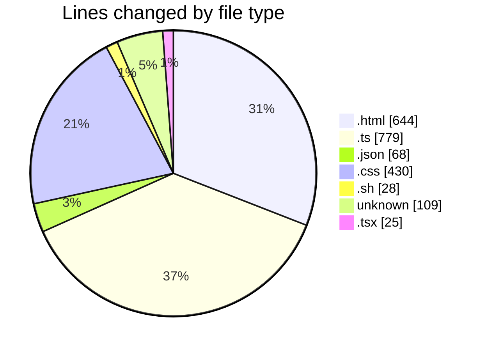

# defer - Activity Summary 

## Overall Statistics

| Stat                   | Value                                                             |
| ---------------------- | ----------------------------------------------------------------- |
| **Lines Added** (➕)   | 1511                                          |
| **Lines Removed** (➖) | 572                                        |
| **Net Change** (↕)    | 939                |
| **Active Time** (⌚)   | 75 minutes |

## Modified Files
- **defer.html** (+49, -31)
- **index.ts** (+168, -0)
- **package.json** (+32, -6)
- **frontend.ts** (+383, -192)
- **tsconfig.json** (+30, -0)
- **vite.config.ts** (+29, -7)
- **defer.css** (+154, -0)
- **index.html** (+289, -275)
- **style.css** (+215, -61)
- **dev.sh** (+28, -0)
- **.gitignore** (+109, -0)
- **App.tsx** (+14, -0)
- **main.tsx** (+11, -0)

## Visualizations

### By File Type (Lines Changed)

### By Hour (Estimated Activity Count)

> **Last Updated:** 20/07/2025, 02:33:10