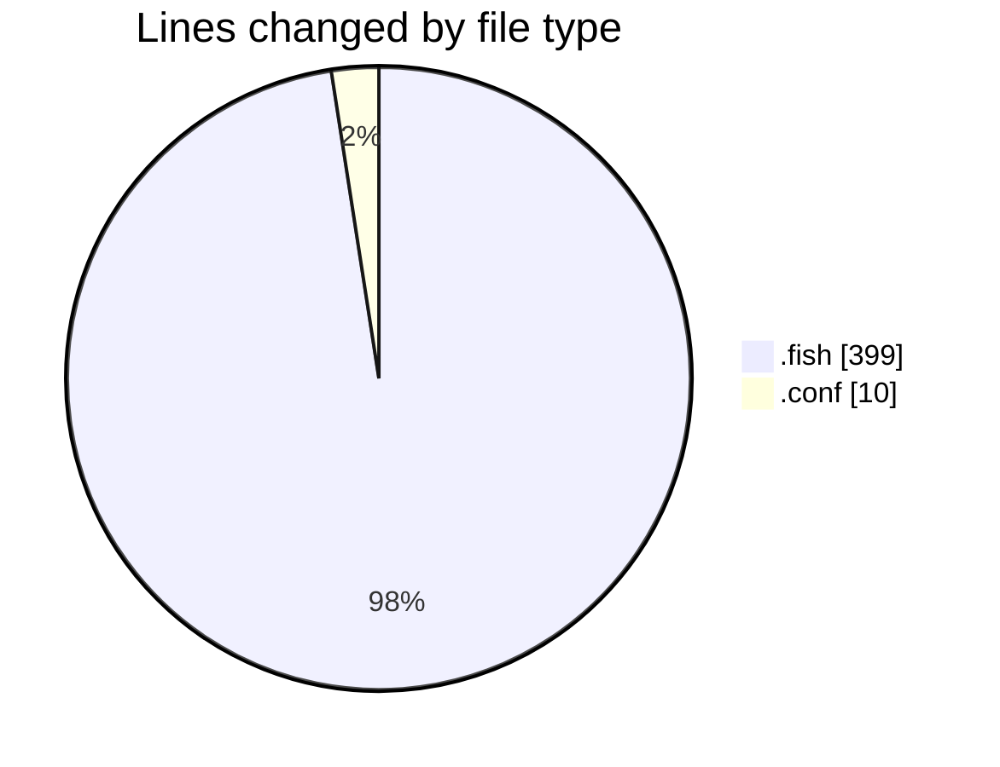
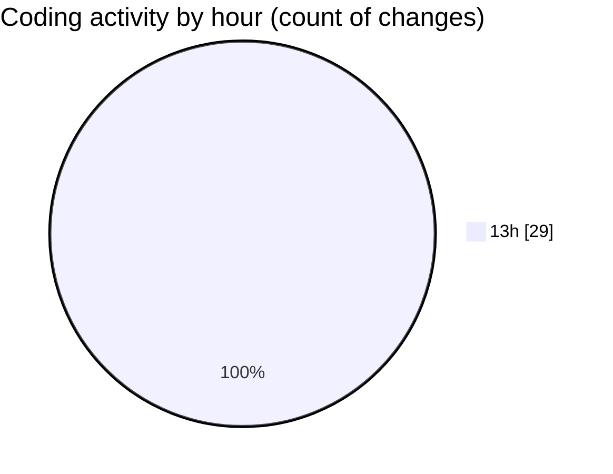

# fish - Activity Summary 

## Overall Statistics

| Stat                   | Value                                                             |
| ---------------------- | ----------------------------------------------------------------- |
| **Lines Added** (➕)   | 370                                          |
| **Lines Removed** (➖) | 39                                        |
| **Net Change** (↕)    | 331                |
| **Active Time** (⌚)   | 33 minutes |

## Modified Files
- **aud.fish** (+89, -9)
- **in.fish** (+28, -8)
- **out.fish** (+28, -8)
- **inn.fish** (+50, -7)
- **outn.fish** (+50, -7)
- **audio_device_filter.conf** (+10, -0)
- **_filter_audio_devices.fish** (+22, -0)
- **_manage_audio_filter.fish** (+93, -0)

## Visualizations

### By File Type (Lines Changed)

### By Hour (Estimated Activity Count)

> **Last Updated:** 20/07/2025, 13:50:40