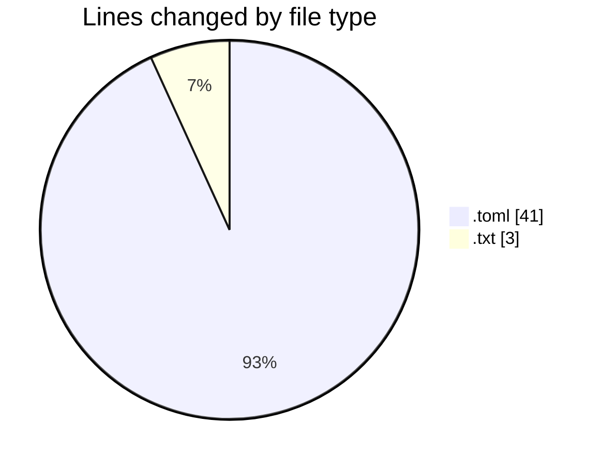
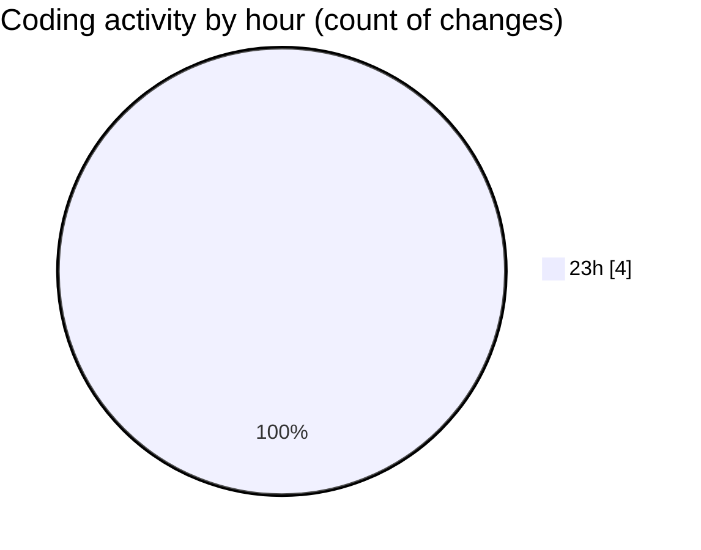

# ableton-mcp-extended - Activity Summary 

## Overall Statistics

| Stat                   | Value                                                             |
| ---------------------- | ----------------------------------------------------------------- |
| **Lines Added** (➕)   | 43                                          |
| **Lines Removed** (➖) | 1                                        |
| **Net Change** (↕)    | 42                |
| **Active Time** (⌚)   | 2 minutes |

## Modified Files
- **pyproject.toml** (+40, -1)
- **options.txt** (+3, -0)

## Visualizations

### By File Type (Lines Changed)

### By Hour (Estimated Activity Count)

> **Last Updated:** 23/07/2025, 23:37:22