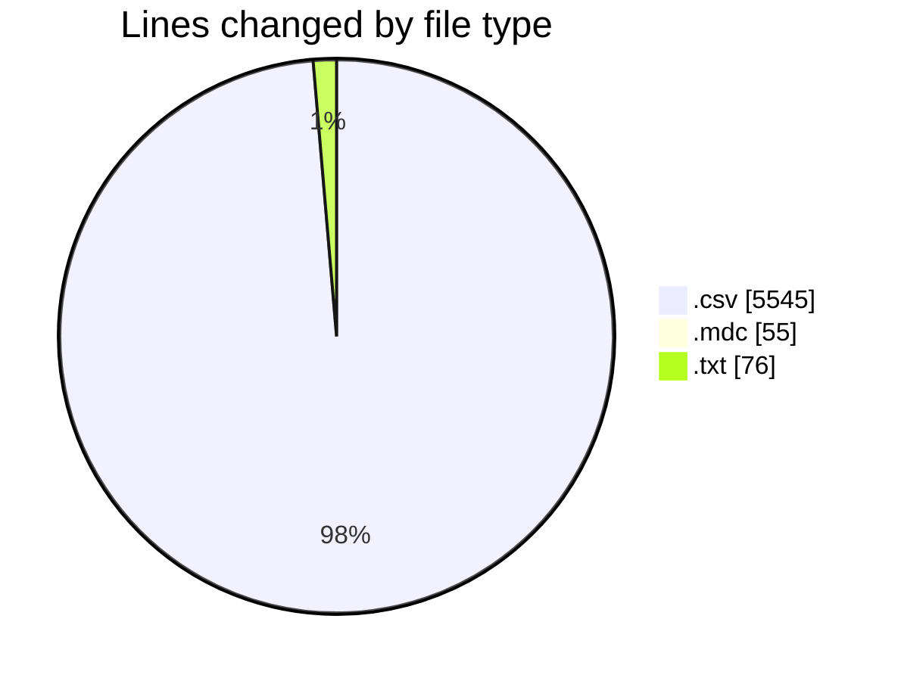
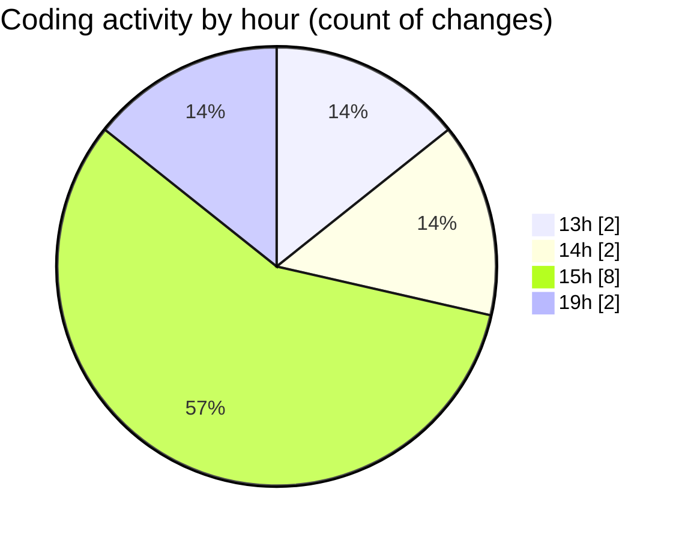

# transactions-new - Activity Summary 

## Overall Statistics

| Stat                   | Value                                                             |
| ---------------------- | ----------------------------------------------------------------- |
| **Lines Added** (➕)   | 5673                                          |
| **Lines Removed** (➖) | 3                                        |
| **Net Change** (↕)    | 5670                |
| **Active Time** (⌚)   | 13 minutes |

## Modified Files
- **transactions.csv** (+1899, -0)
- **entities.csv** (+911, -0)
- **1.csv** (+451, -0)
- **2.csv** (+459, -1)
- **2025.csv** (+912, -0)
- **csv.mdc** (+55, -0)
- **uc_columns.csv** (+912, -0)
- **field.txt** (+74, -2)

## Visualizations

### By File Type (Lines Changed)

### By Hour (Estimated Activity Count)

> **Last Updated:** 23/07/2025, 19:15:06