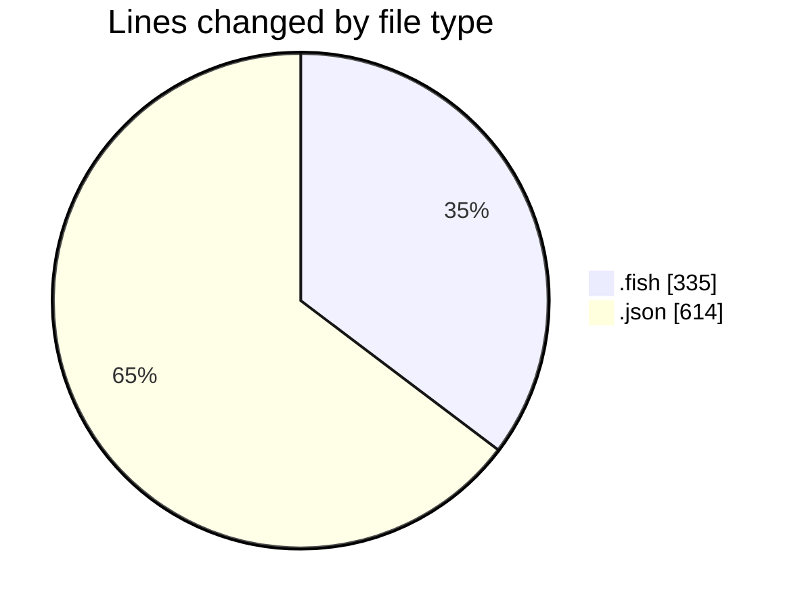
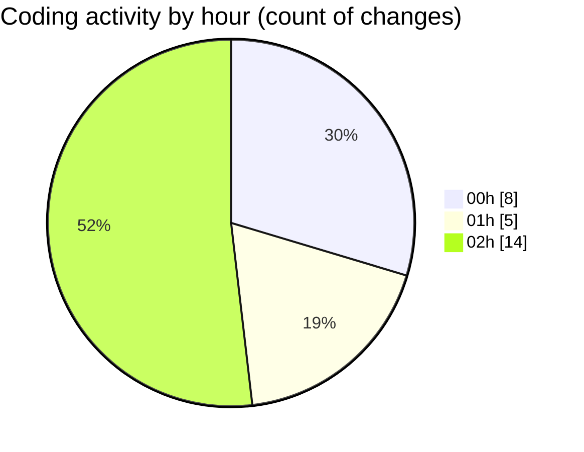

# fish - Activity Summary 

## Overall Statistics

| Stat                   | Value                                                             |
| ---------------------- | ----------------------------------------------------------------- |
| **Lines Added** (➕)   | 917                                          |
| **Lines Removed** (➖) | 32                                        |
| **Net Change** (↕)    | 885                |
| **Active Time** (⌚)   | 29 minutes |

## Modified Files
- **dot_aliases.fish** (+20, -2)
- **config.fish** (+31, -1)
- **env.fish** (+135, -5)
- **settings.json** (+534, -1)
- **claude-flow.fish** (+54, -0)
- **claude.fish** (+87, -0)
- **settings.json** (+56, -23)

## Visualizations

### By File Type (Lines Changed)

### By Hour (Estimated Activity Count)

> **Last Updated:** 24/07/2025, 03:03:37