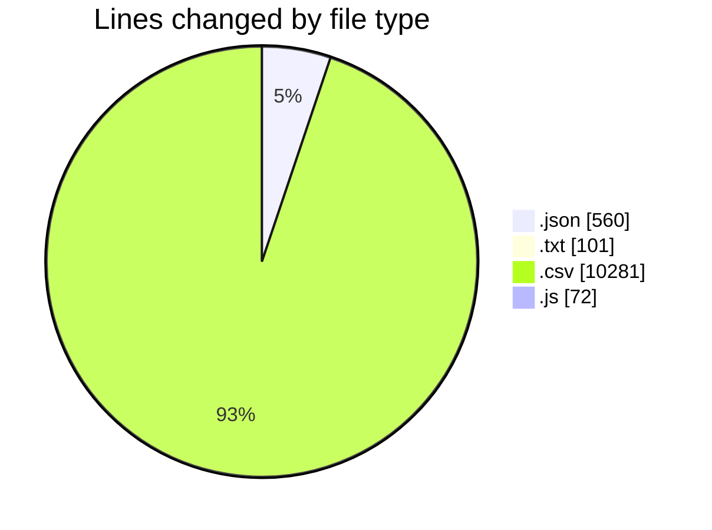
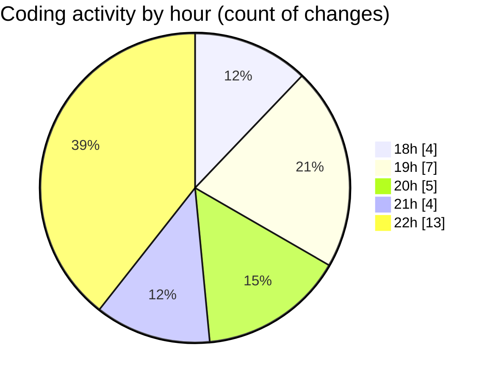

# refunds - Activity Summary 

## Overall Statistics

| Stat                   | Value                                                             |
| ---------------------- | ----------------------------------------------------------------- |
| **Lines Added** (➕)   | 7050                                          |
| **Lines Removed** (➖) | 3964                                        |
| **Net Change** (↕)    | 3086                |
| **Active Time** (⌚)   | 39 minutes |

## Modified Files
- **.mcp.json** (+14, -0)
- **.claude.json** (+14, -0)
- **payments.txt** (+85, -1)
- **Transactions.csv** (+518, -92)
- **settings.json** (+532, -0)
- **airtable_field_contains_check.js** (+72, -0)
- **Transaction Export.csv** (+5800, -3871)
- **sync-transactions-log.txt** (+15, -0)

## Visualizations

### By File Type (Lines Changed)

### By Hour (Estimated Activity Count)

> **Last Updated:** 27/07/2025, 22:37:25