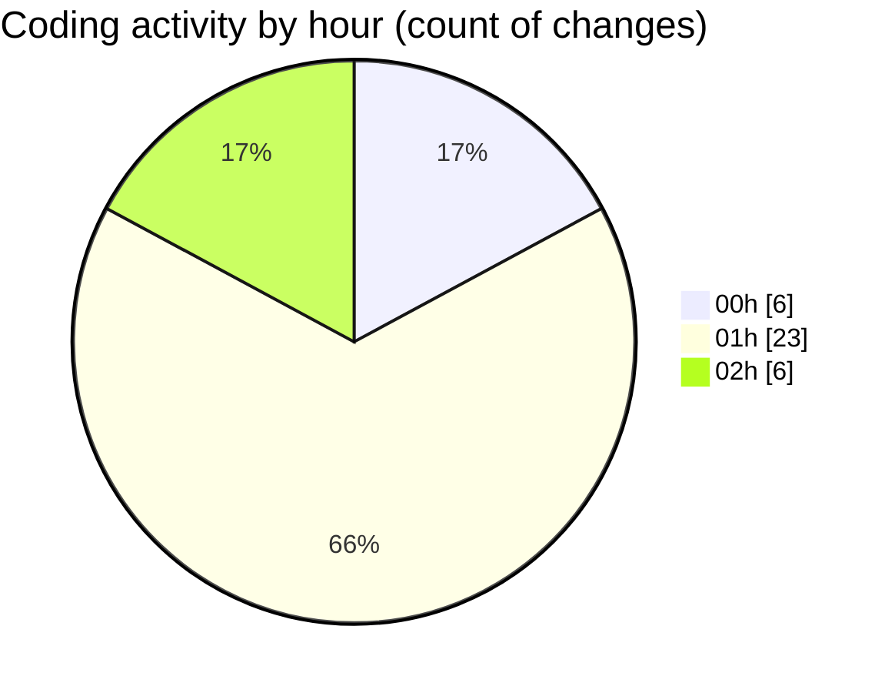

# refunds - Activity Summary 

## Overall Statistics

| Stat                   | Value                                                             |
| ---------------------- | ----------------------------------------------------------------- |
| **Lines Added** (➕)   | 2749                                          |
| **Lines Removed** (➖) | 832                                        |
| **Net Change** (↕)    | 1917                |
| **Active Time** (⌚)   | 53 minutes |

## Modified Files
- **enrichment_pre.py** (+372, -212)
- **enrichment.py** (+692, -590)
- **.claude.json** (+1219, -30)
- **Transaction Export.enriched.csv** (+52, -0)
- **unique_vendors.txt** (+414, -0)

## Visualizations

### By File Type (Lines Changed)

### By Hour (Estimated Activity Count)

> **Last Updated:** 28/07/2025, 03:02:26