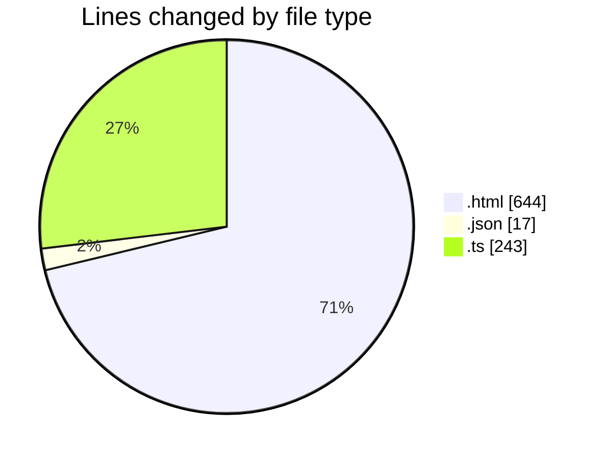
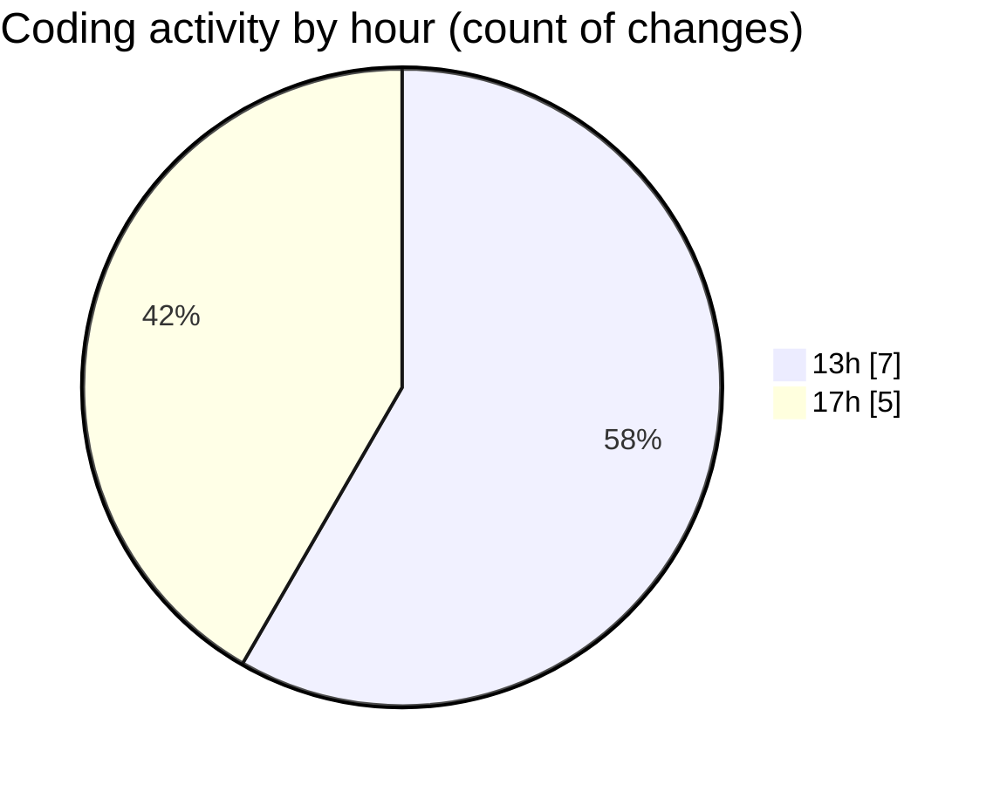

# invoices - Activity Summary 

## Overall Statistics

| Stat                   | Value                                                             |
| ---------------------- | ----------------------------------------------------------------- |
| **Lines Added** (➕)   | 904                                          |
| **Lines Removed** (➖) | 0                                        |
| **Net Change** (↕)    | 904                |
| **Active Time** (⌚)   | 14 minutes |

## Modified Files
- **TP-001.html** (+212, -0)
- **package.json** (+17, -0)
- **index.ts** (+243, -0)
- **TP-001.html** (+216, -0)
- **SUI-001.html** (+216, -0)

## Visualizations

### By File Type (Lines Changed)

### By Hour (Estimated Activity Count)

> **Last Updated:** 29/07/2025, 18:00:08