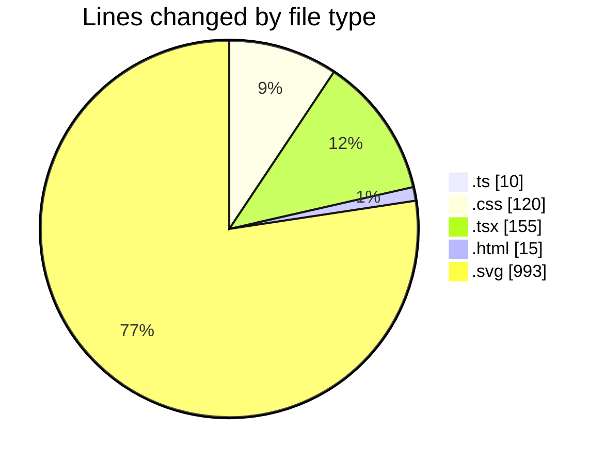
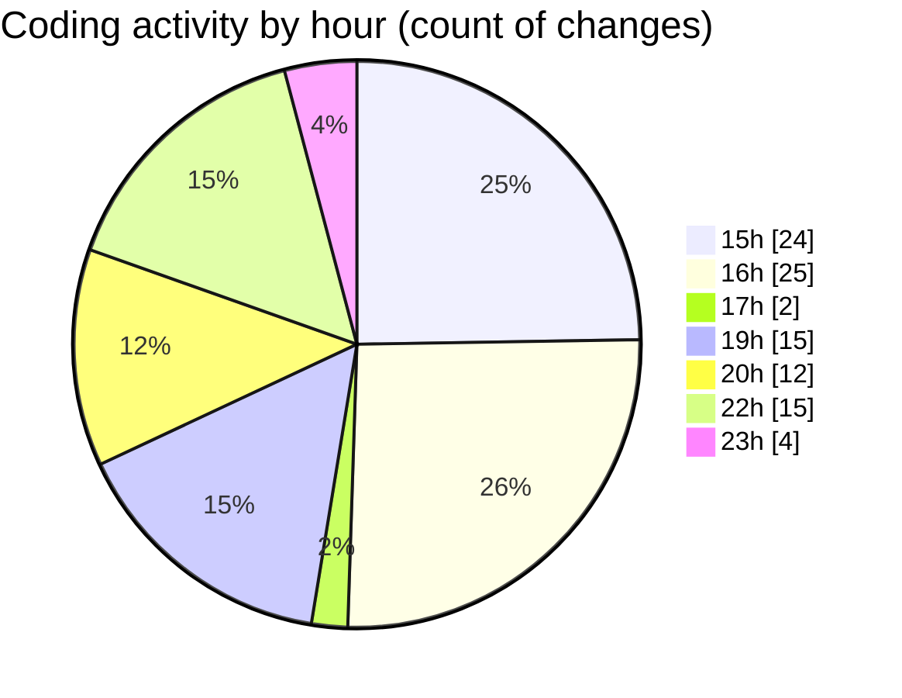

# tw-server - Activity Summary 

## Overall Statistics

| Stat                   | Value                                                             |
| ---------------------- | ----------------------------------------------------------------- |
| **Lines Added** (➕)   | 1125                                          |
| **Lines Removed** (➖) | 168                                        |
| **Net Change** (↕)    | 957                |
| **Active Time** (⌚)   | 140 minutes |

## Modified Files
- **vite.config.ts** (+8, -2)
- **App.css** (+43, -41)
- **main.tsx** (+11, -1)
- **App.tsx** (+95, -48)
- **index.html** (+14, -1)
- **tailwind.css** (+34, -2)
- **diagram.svg** (+323, -3)
- **test.svg** (+117, -20)
- **animated.svg** (+13, -0)
- **test copy.svg** (+22, -3)
- **test2.svg** (+152, -0)
- **test-various.svg** (+135, -33)
- **test-various copy.svg** (+114, -9)
- **b64.svg** (+22, -0)
- **b64.svg** (+22, -5)

## Visualizations

### By File Type (Lines Changed)

### By Hour (Estimated Activity Count)

> **Last Updated:** 31/07/2025, 23:52:52