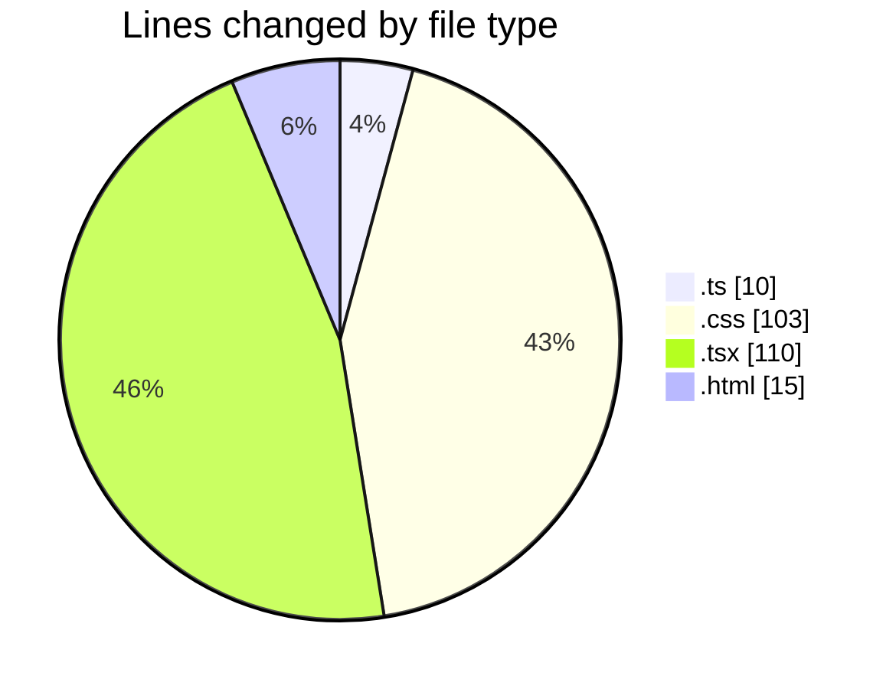
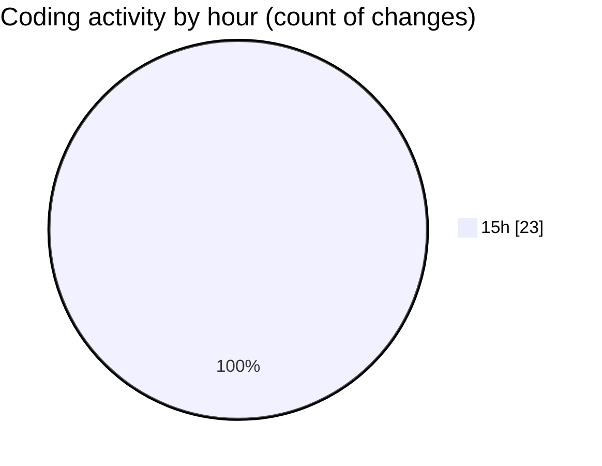

# tw-server - Activity Summary 

## Overall Statistics

| Stat                   | Value                                                             |
| ---------------------- | ----------------------------------------------------------------- |
| **Lines Added** (➕)   | 168                                          |
| **Lines Removed** (➖) | 70                                        |
| **Net Change** (↕)    | 98                |
| **Active Time** (⌚)   | 33 minutes |

## Modified Files
- **vite.config.ts** (+8, -2)
- **App.css** (+43, -41)
- **main.tsx** (+11, -1)
- **App.tsx** (+75, -23)
- **index.html** (+14, -1)
- **tailwind.css** (+17, -2)

## Visualizations

### By File Type (Lines Changed)

### By Hour (Estimated Activity Count)

> **Last Updated:** 31/07/2025, 15:57:52