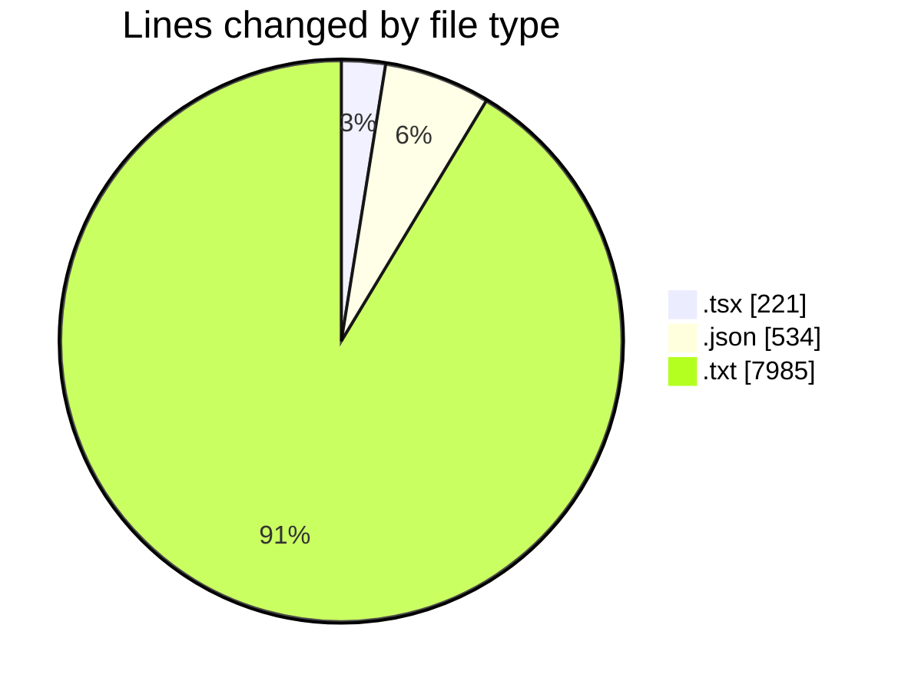
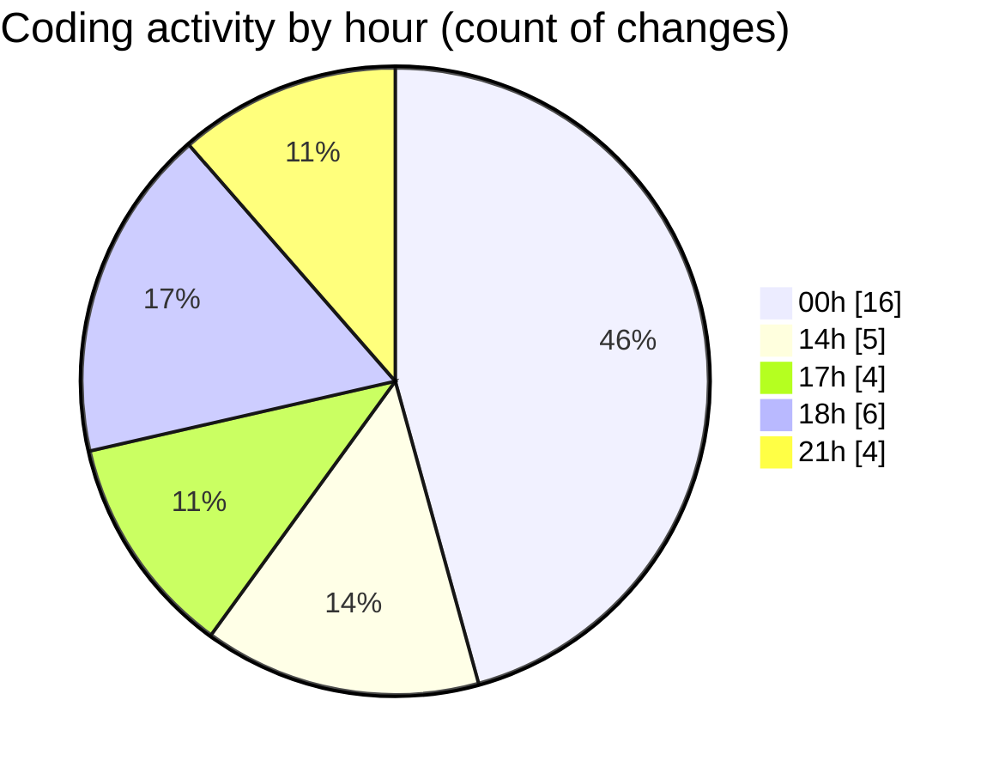

# tw-server - Activity Summary 

## Overall Statistics

| Stat                   | Value                                                             |
| ---------------------- | ----------------------------------------------------------------- |
| **Lines Added** (➕)   | 7182                                          |
| **Lines Removed** (➖) | 1558                                        |
| **Net Change** (↕)    | 5624                |
| **Active Time** (⌚)   | 40 minutes |

## Modified Files
- **App.tsx** (+179, -42)
- **settings.json** (+533, -1)
- **package_directories.txt** (+435, -197)
- **package_directories_pro_g40.txt** (+2653, -1299)
- **package_directories_pro_g40_with_root_package_json.txt** (+1354, -16)
- **package_directories_with_root_package_json.txt** (+238, -0)
- **package_json_directories.txt** (+1575, -3)
- **airtable urls.txt** (+43, -0)
- **airtable_urls.txt** (+172, -0)

## Visualizations

### By File Type (Lines Changed)

### By Hour (Estimated Activity Count)

> **Last Updated:** 01/08/2025, 21:28:54