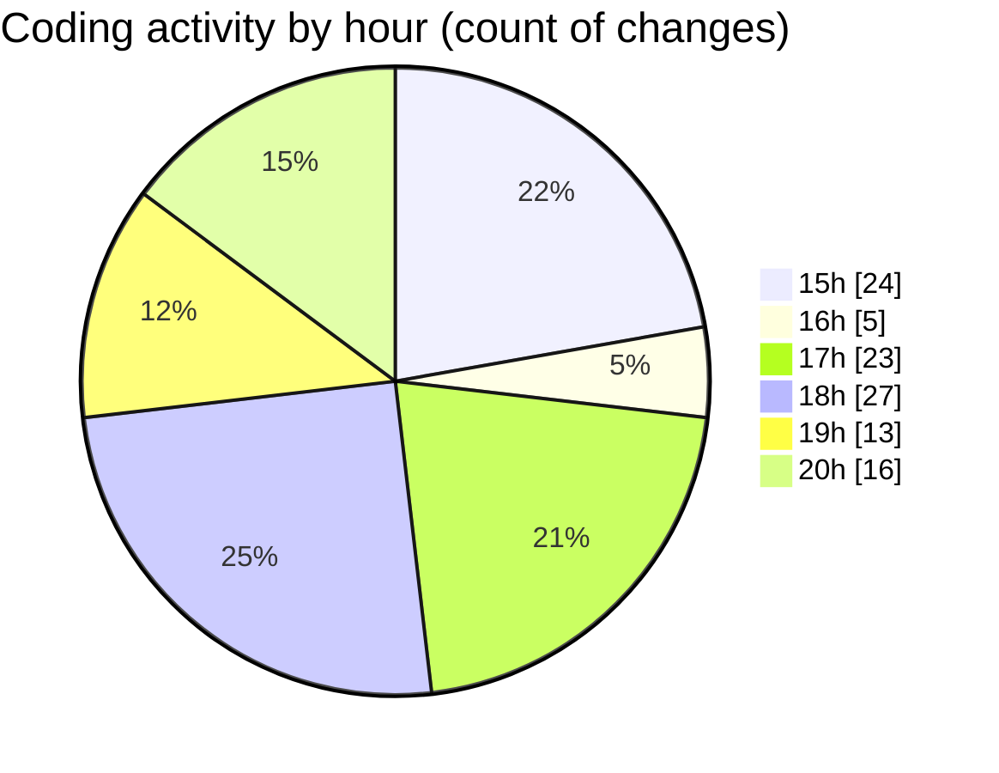

# tw-server - Activity Summary 

## Overall Statistics

| Stat                   | Value                                                             |
| ---------------------- | ----------------------------------------------------------------- |
| **Lines Added** (➕)   | 1245                                          |
| **Lines Removed** (➖) | 426                                        |
| **Net Change** (↕)    | 819                |
| **Active Time** (⌚)   | 149 minutes |

## Modified Files
- **App.tsx** (+547, -372)
- **Logo.tsx** (+54, -22)
- **types.ts** (+8, -0)
- **settings.json** (+533, -1)
- **tailwind.css** (+68, -14)
- **Asset.tsx** (+35, -17)

## Visualizations

### By File Type (Lines Changed)

### By Hour (Estimated Activity Count)

> **Last Updated:** 02/08/2025, 21:00:09