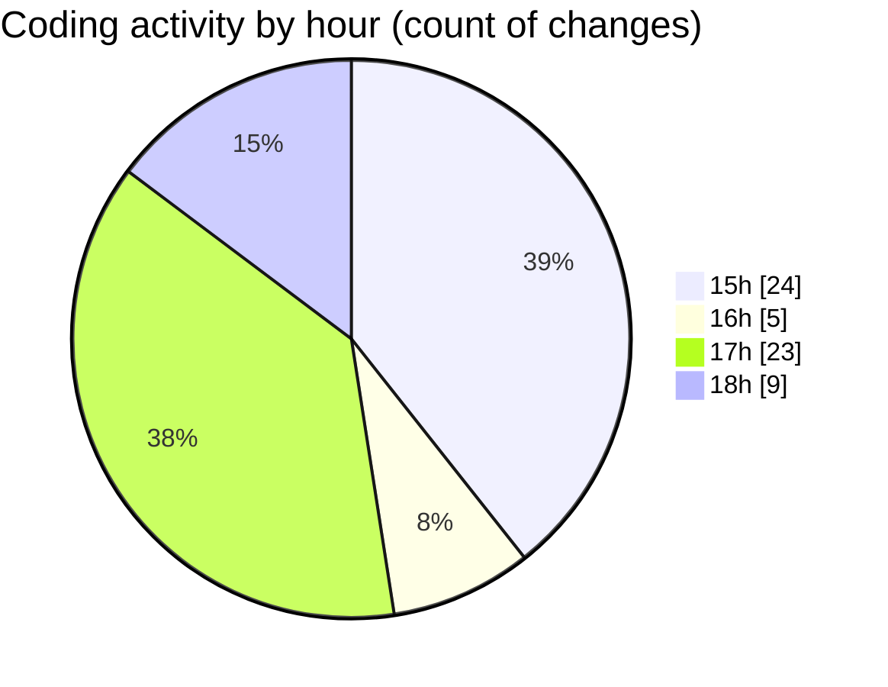

# tw-server - Activity Summary 

## Overall Statistics

| Stat                   | Value                                                             |
| ---------------------- | ----------------------------------------------------------------- |
| **Lines Added** (➕)   | 1011                                          |
| **Lines Removed** (➖) | 224                                        |
| **Net Change** (↕)    | 787                |
| **Active Time** (⌚)   | 92 minutes |

## Modified Files
- **App.tsx** (+353, -191)
- **Logo.tsx** (+29, -2)
- **types.ts** (+2, -0)
- **settings.json** (+533, -1)
- **tailwind.css** (+67, -13)
- **Asset.tsx** (+27, -17)

## Visualizations

### By File Type (Lines Changed)

### By Hour (Estimated Activity Count)

> **Last Updated:** 02/08/2025, 18:20:09