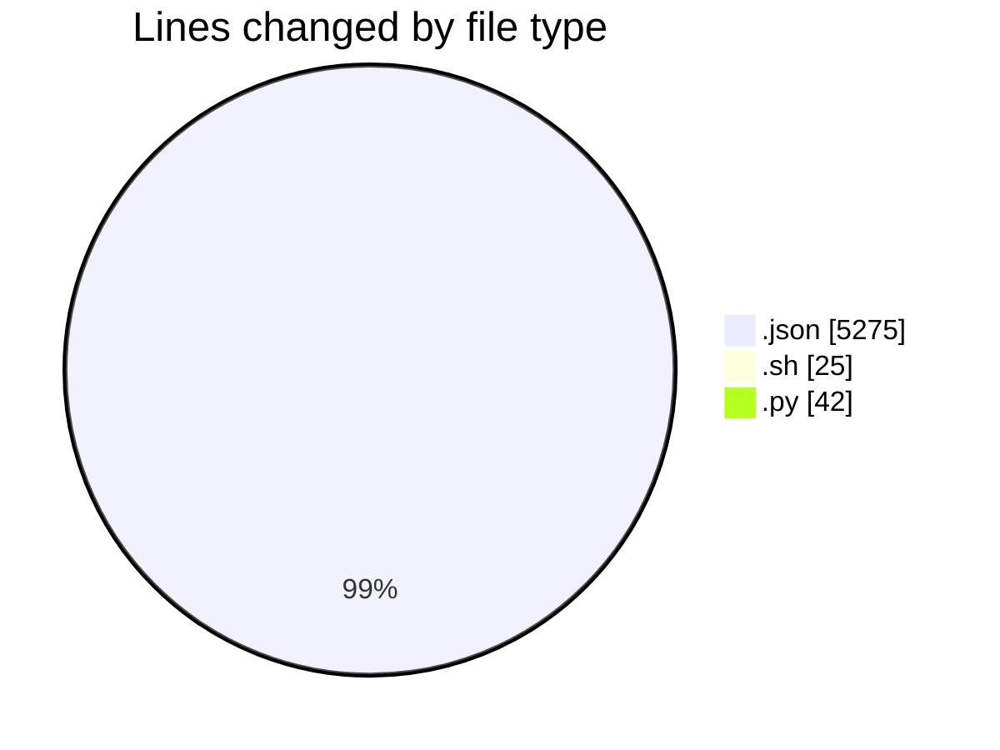
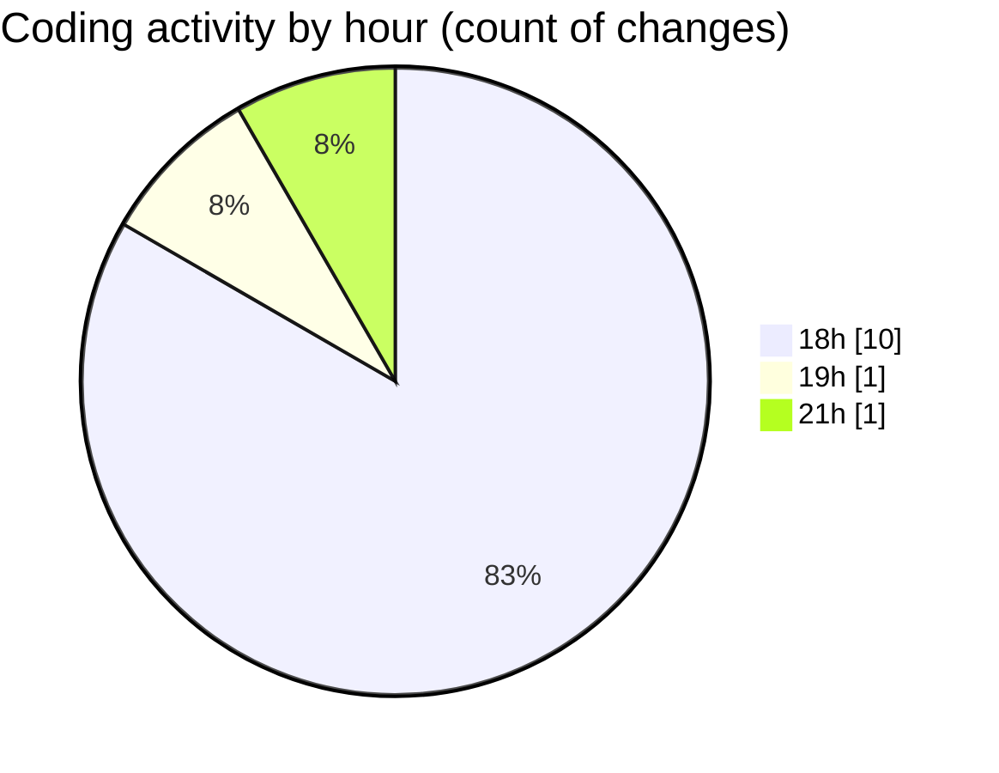

# .claude - Activity Summary 

## Overall Statistics

| Stat                   | Value                                                             |
| ---------------------- | ----------------------------------------------------------------- |
| **Lines Added** (➕)   | 5342                                          |
| **Lines Removed** (➖) | 0                                        |
| **Net Change** (↕)    | 5342                |
| **Active Time** (⌚)   | 7 minutes |

## Modified Files
- **settings.json** (+196, -0)
- **.claude.json** (+5079, -0)
- **start.sh** (+5, -0)
- **PreToolUse.sh** (+5, -0)
- **stop.sh** (+5, -0)
- **SubagentStop.sh** (+5, -0)
- **Notification.sh** (+5, -0)
- **elevenlabs_tts.py** (+42, -0)

## Visualizations

### By File Type (Lines Changed)

### By Hour (Estimated Activity Count)

> **Last Updated:** 03/08/2025, 21:30:39