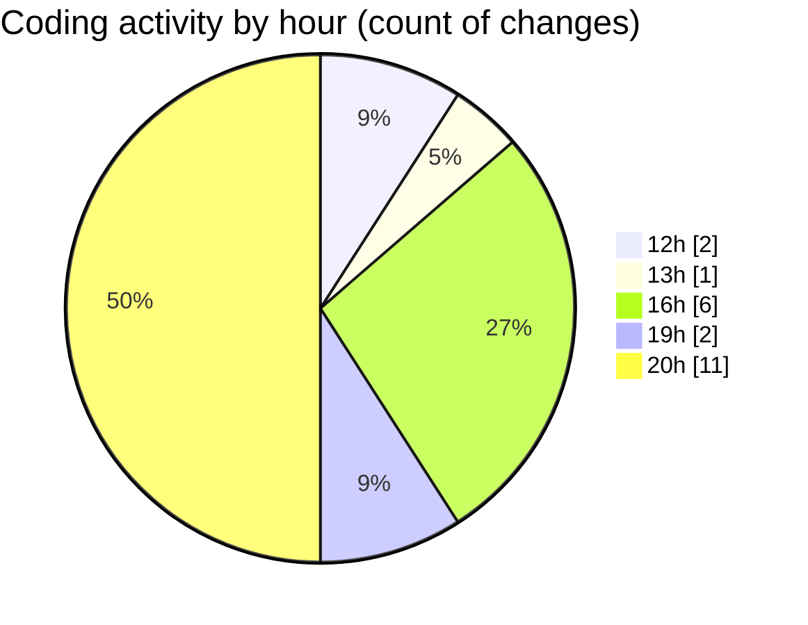

# macrowhisper - Activity Summary 

## Overall Statistics

| Stat                   | Value                                                             |
| ---------------------- | ----------------------------------------------------------------- |
| **Lines Added** (➕)   | 733                                          |
| **Lines Removed** (➖) | 75                                        |
| **Net Change** (↕)    | 658                |
| **Active Time** (⌚)   | 27 minutes |

## Modified Files
- **macrowhisper.json** (+126, -9)
- **macrowhisper.json** (+297, -0)
- **providers.template.yaml** (+125, -64)
- **providers.yaml** (+61, -2)
- **.gitignore_global** (+124, -0)

## Visualizations

### By File Type (Lines Changed)

### By Hour (Estimated Activity Count)

> **Last Updated:** 03/08/2025, 20:41:43