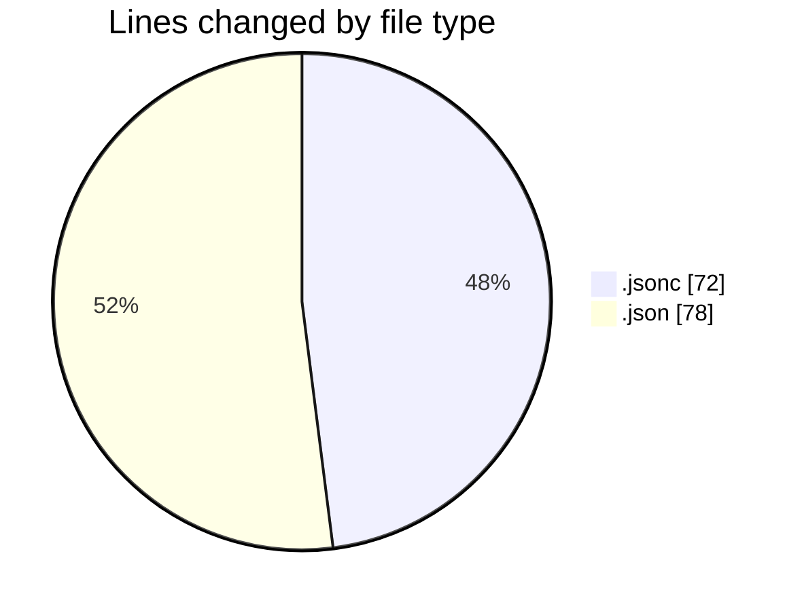

# opencode - Activity Summary 

## Overall Statistics

| Stat                   | Value                                                             |
| ---------------------- | ----------------------------------------------------------------- |
| **Lines Added** (➕)   | 137                                          |
| **Lines Removed** (➖) | 13                                        |
| **Net Change** (↕)    | 124                |
| **Active Time** (⌚)   | 27 minutes |

## Modified Files
- **opencode.jsonc** (+63, -9)
- **opencode.json** (+62, -4)
- **client_secret_227280284109-6h5fmd5q47qovcshi443j5u93ju9hf3k.apps.googleusercontent.com.json** (+12, -0)

## Visualizations

### By File Type (Lines Changed)

### By Hour (Estimated Activity Count)

> **Last Updated:** 03/08/2025, 21:56:19