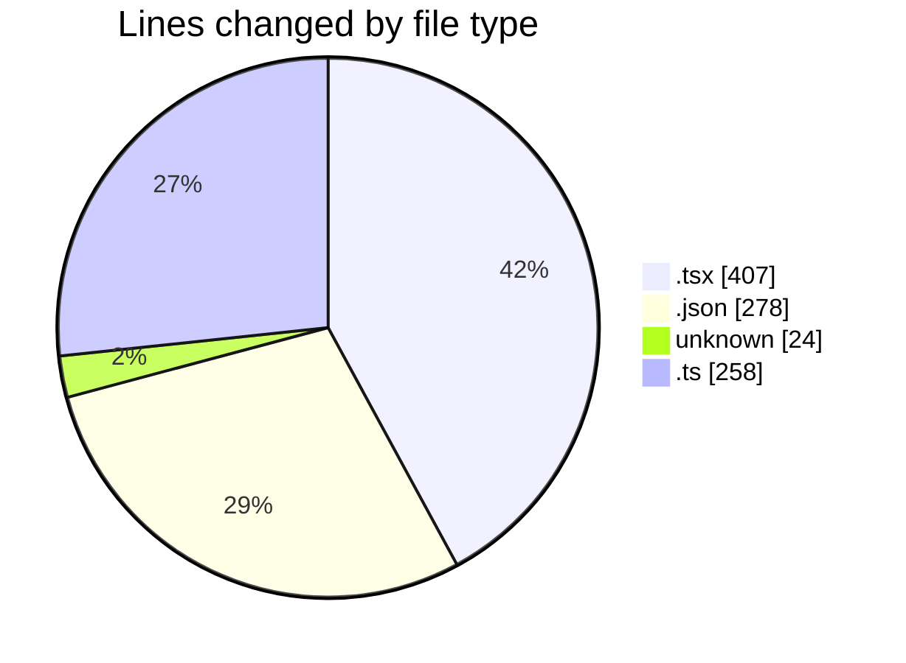
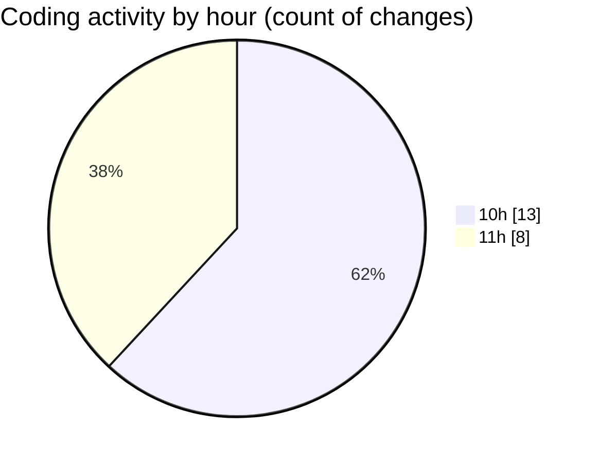

# ribbon - Activity Summary 

## Overall Statistics

| Stat                   | Value                                                             |
| ---------------------- | ----------------------------------------------------------------- |
| **Lines Added** (➕)   | 890                                          |
| **Lines Removed** (➖) | 77                                        |
| **Net Change** (↕)    | 813                |
| **Active Time** (⌚)   | 21 minutes |

## Modified Files
- **searchable-container.tsx** (+181, -54)
- **page.tsx** (+13, -1)
- **VirtualizedFinder.tsx** (+115, -3)
- **package.json** (+272, -1)
- **.cursorrules** (+24, -0)
- **useImageLoading.tsx** (+40, -0)
- **package.json** (+3, -2)
- **init.ts** (+164, -16)
- **bypass.ts** (+78, -0)

## Visualizations

### By File Type (Lines Changed)

### By Hour (Estimated Activity Count)

> **Last Updated:** 04/08/2025, 11:11:41