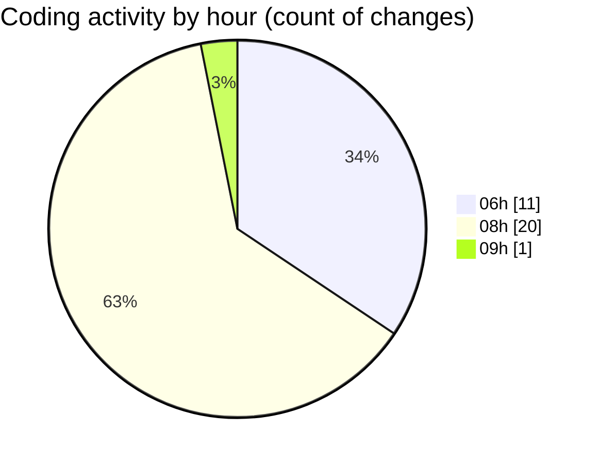

# tw-server - Activity Summary 

## Overall Statistics

| Stat                   | Value                                                             |
| ---------------------- | ----------------------------------------------------------------- |
| **Lines Added** (➕)   | 1682                                          |
| **Lines Removed** (➖) | 24                                        |
| **Net Change** (↕)    | 1658                |
| **Active Time** (⌚)   | 34 minutes |

## Modified Files
- **IsometricGrid.tsx** (+55, -0)
- **settings.json** (+537, -0)
- **utils.ts** (+8, -6)
- **tailwind.css** (+163, -2)
- **App.tsx** (+266, -6)
- **keybindings.json** (+645, -4)
- **types.ts** (+8, -6)

## Visualizations

### By File Type (Lines Changed)

### By Hour (Estimated Activity Count)

> **Last Updated:** 04/08/2025, 09:09:23