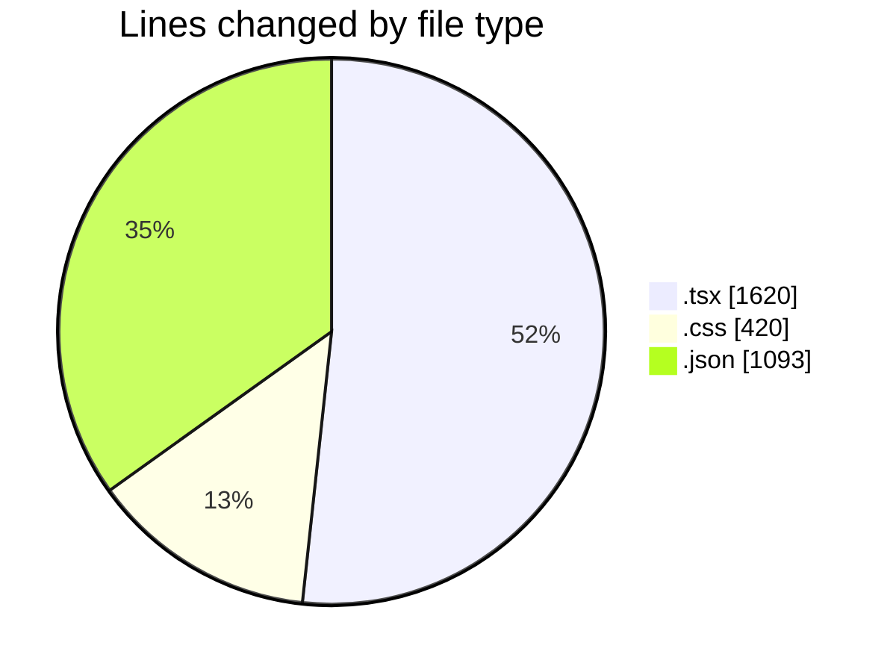
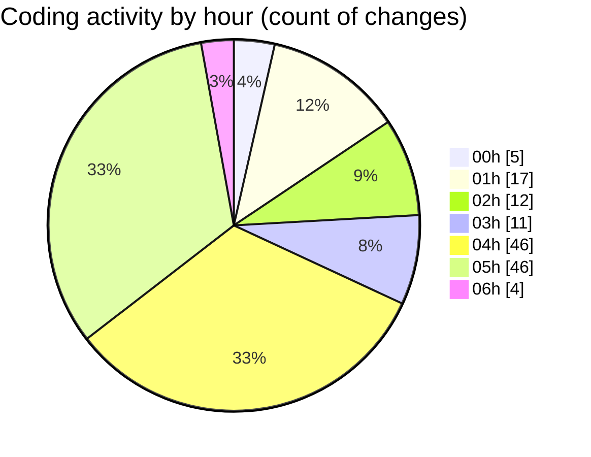

# tw-server - Activity Summary 

## Overall Statistics

| Stat                   | Value                                                             |
| ---------------------- | ----------------------------------------------------------------- |
| **Lines Added** (➕)   | 2478                                          |
| **Lines Removed** (➖) | 655                                        |
| **Net Change** (↕)    | 1823                |
| **Active Time** (⌚)   | 193 minutes |

## Modified Files
- **App.tsx** (+129, -21)
- **Asset.tsx** (+79, -1)
- **tailwind.css** (+62, -1)
- **settings.json** (+1077, -6)
- **mcp_settings.json** (+10, -0)
- **GridExample.tsx** (+548, -376)
- **IsometricGrid.tsx** (+281, -174)
- **IsometricGrid.css** (+281, -76)
- **main.tsx** (+11, -0)

## Visualizations

### By File Type (Lines Changed)

### By Hour (Estimated Activity Count)

> **Last Updated:** 04/08/2025, 06:02:59