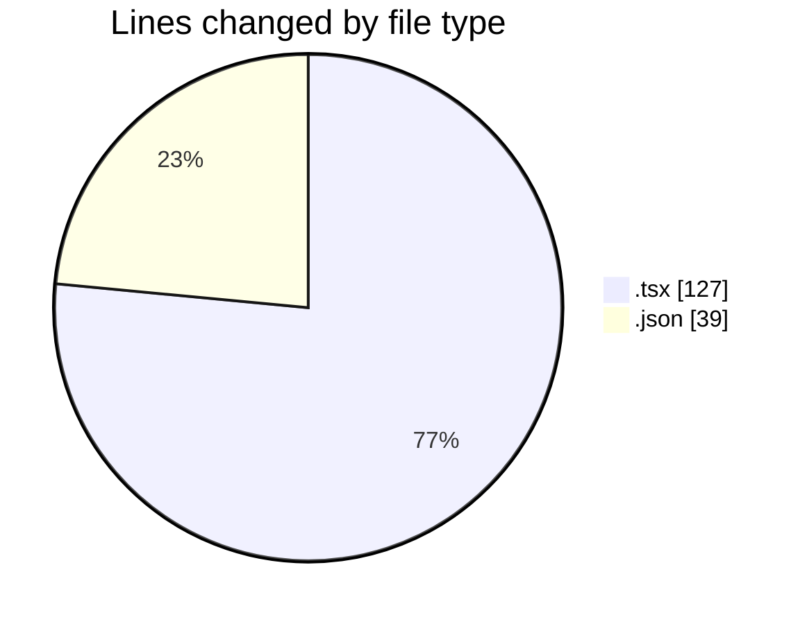

# tw-server - Activity Summary 

## Overall Statistics

| Stat                   | Value                                                             |
| ---------------------- | ----------------------------------------------------------------- |
| **Lines Added** (➕)   | 164                                          |
| **Lines Removed** (➖) | 2                                        |
| **Net Change** (↕)    | 162                |
| **Active Time** (⌚)   | 11 minutes |

## Modified Files
- **App.tsx** (+4, -2)
- **IsometricGrid.tsx** (+55, -0)
- **package.json** (+39, -0)
- **main.tsx** (+66, -0)

## Visualizations

### By File Type (Lines Changed)

### By Hour (Estimated Activity Count)

> **Last Updated:** 05/08/2025, 16:24:25