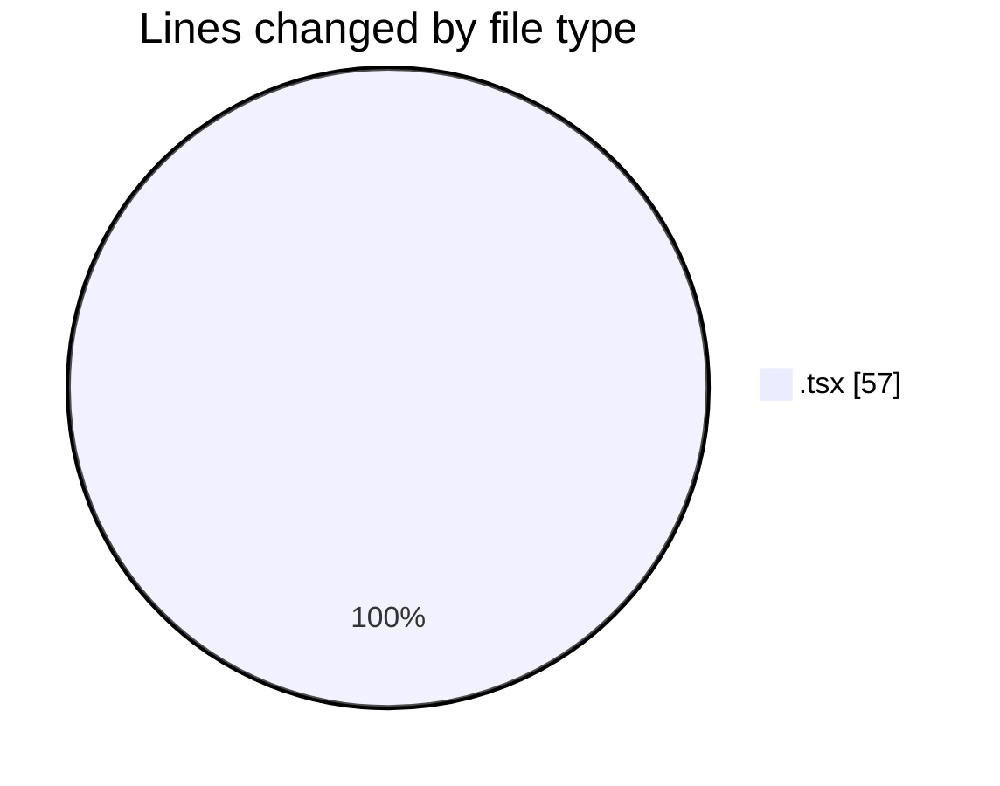
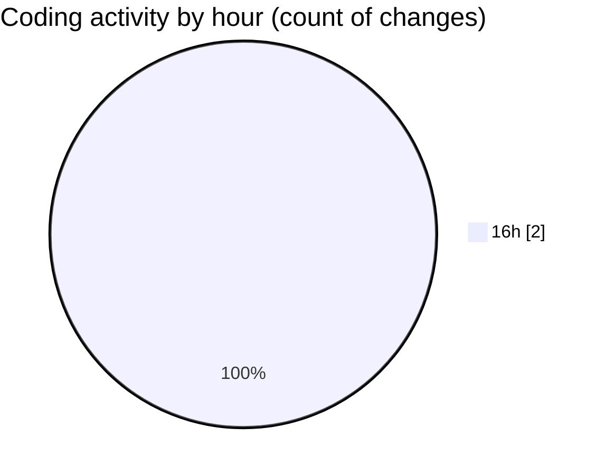

# tw-server - Activity Summary 

## Overall Statistics

| Stat                   | Value                                                             |
| ---------------------- | ----------------------------------------------------------------- |
| **Lines Added** (➕)   | 55                                          |
| **Lines Removed** (➖) | 2                                        |
| **Net Change** (↕)    | 53                |
| **Active Time** (⌚)   | 2 minutes |

## Modified Files
- **App.tsx** (+0, -2)
- **IsometricGrid.tsx** (+55, -0)

## Visualizations

### By File Type (Lines Changed)

### By Hour (Estimated Activity Count)

> **Last Updated:** 05/08/2025, 16:19:25